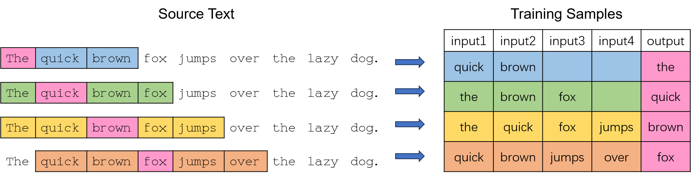
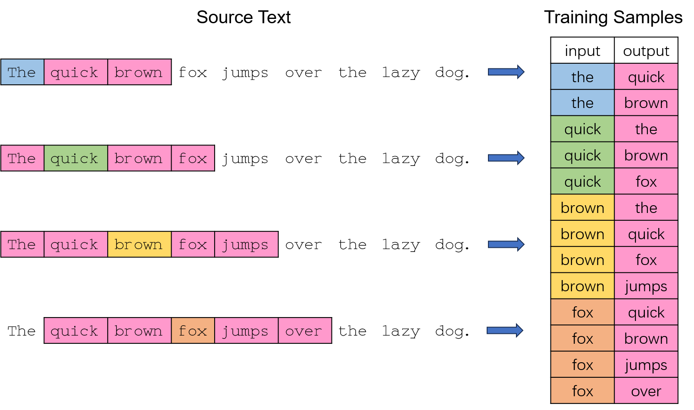
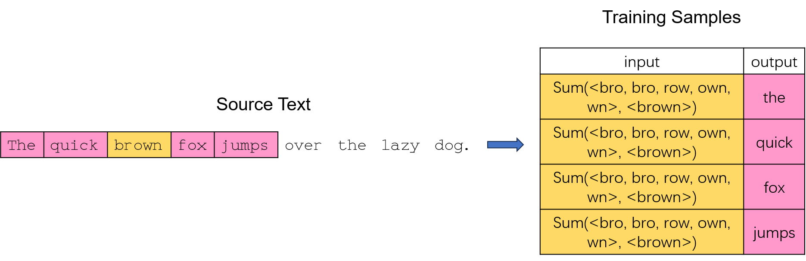

## Embedding 是什么

人类可以直接理解现实世界的对象，如文本、图像和音频等，而机器只能够处理数值数据，无法理解这些对象。为了能够让机器进行理解，必须先将它们转化为数值形式。Embedding 就是将现实对象表示为连续向量空间中的点的方法，这些点在空间中的位置蕴含着对象的信息。

具体在 NLP 领域中，词嵌入（Word Embedding）就是将单词转化为数值向量，且向量的相对位置反映了词之间的语义相似性和关系。假设有以下 embedding 后的结果：

- cat：[0.2, -0.4, 0.7]
- dog：[0.6, 0.1, 0.5]
- apple：[0.8, -0.2, -0.3]
- orange：[0.7, -0.1, -0.6]
- happy：[-0.5, 0.9, 0.2]
- sad：[0.4, -0.7, -0.5]

一共 6 个单词，每个单词转化成维度为 3 的向量，进而可以通过计算向量之间的[余弦相似性](https://en.wikipedia.org/wiki/Cosine_similarity)来判断单词的相似度：

$$\begin{aligned}
\text{cosine\_similarity(cat, dog)}&=0.66, \\ \text{cosine\_similarity(cat, apple)}&=0.04.
\end{aligned}$$

猫和狗都是动物，余弦相似性达到 0.66，而猫和苹果几乎没有任何关系，余弦相似性只有 0.04。

## Word2Vec

[Word2Vec](https://arxiv.org/pdf/1301.3781) 有两个用于生成词向量的模型：CBOW(Continuous Bag of Words) 和 Skip-gram。

1.CBOW 通过给定窗口中的上下文单词来预测中心单词。

2.Skip-gram 以中心单词为输入，预测给定窗口的上下文单词。

以 Skip-gram 为例，模型使用只有一个没有激活函数的隐藏层的神经网络来训练，由于输入和输出都是离散的单词，可以使用[独热编码（One-hot）](https://en.wikipedia.org/wiki/One-hot)来表示，神经网络的结构如下：

假设词库大小为 10000，embedding 的大小是 300，输入单词“ant”是一个1\(\times\)10000 的向量，经过 [softmax](https://en.wikipedia.org/wiki/Softmax_function) 的输出层也是一个 1\(\times\)10000 的向量，它的每个分量表示各个单词的概率。因此，输入层到隐藏层的 embedding 权重矩阵大小为 10000\(\times\)300，隐藏层到输出层的权重矩阵大小为 300\(\times\)10000。通过反向误差传播更新参数，即可得到 embedding 矩阵，每一行对应的就是各个单词的向量表示。

可以看到，神经网络每一层都要训练 300\(\times\)10000=3M 个参数，并且需要大量的训练数据防止过拟合，这意味着训练过程将非常缓慢，效率很低。Word2Vec 的作者在[第一篇文章](https://arxiv.org/pdf/1301.3781)中提出使用 hierarchical softmax 来提高效率，而[第二篇文章](https://arxiv.org/pdf/1310.4546)中提出了另外两个策略来解决这个问题。

**1.Subsampling of frequent words**

在一段英文文本中，“the”、“in”和“a”这类单词与很多单词同时出现，它们通常不能够给我们提供许多上下文信息。也就是说，这种频繁使用的单词的向量表示在成千上万的样本训练中变化很小。

作者提出了一种 subsampling 策略来解决这个问题，训练集中的每个单词都以一定的概率被丢弃：

$$P(w_{i})=1-\sqrt{\frac{t}{f(w_{i})}}.$$

其中，\(f(w_{i})\) 是单词 \(w_{i}\) 出现的频率，\(t\) 是一个阈值。单词出现频率越高，越有可能被丢弃。

**2.Negative sampling**

输出是一个 1\(\times\)10000 的概率向量，这导致隐藏层到输出层的权重矩阵很大。由于只关心输出是否为正确的单词，因此将标签设置为 1（正确）和 0（错误），模型接受训练集的输入词和输出词，输出一个衡量输入词和输出词是否匹配（属于同一个上下文窗口）的分数。具体地，计算输入词和输出词两个 embedding 向量的点积，再经过 [sigmoid](https://en.wikipedia.org/wiki/Sigmoid_function) 转化为 0-1 之间的数。

但这样还有一个问题，训练样本的标签全都是 1，只要令模型的输出始终为 1，则正确率就有 100%，这是毫无意义的。因此，对于每一个正样本，都从预料库中选取一些单词作为负样本（小数据集 5-20 个，大数据集 2-5 个），原论文采取的负样本单词选取的概率公式为：

$$P(w_{i})=\frac{f(w_{i})^{\frac{3}{4}}}{\sum_{j=0}^{n}f(w_{j})^{\frac{3}{4}}}.$$

模型训练时，每次仅对一个正样本及其对应的几个负样本更新参数，假设每个正样本选取 5 个负样本，那么隐藏层到输出层的参数为 6\(\times\)300=1800，远远小于原来的 3M 个参数。

## GloVe

GloVe 引入共现矩阵（Co-occurrence Matrix），矩阵的每个元素表示两个单词同时出现在一个上下文窗口的次数。假设语料库有两句话，分别是“I love you.”和“I fall in love with you.”，窗口长度为 2，那么共现矩阵如下：

|        | I   | love   | you   | fall   | in   | with   |
| :----: | :-: | :----: | :---: | :----: | :--: | :----: |
| I      | 0   | 1      | 1     | 1      | 1    | 0      |
| love   | 1   | 0      | 2     | 1      | 1    | 1      |
| you    | 1   | 2      | 0     | 0      | 0    | 1      |
| fall   | 1   | 1      | 0     | 0      | 1    | 0      |
| in     | 1   | 1      | 0     | 1      | 0    | 1      |
| with   | 0   | 1      | 1     | 0      | 1    | 0      |

共现矩阵 \(X\) 的每一个元素 \(X_{ij}\) 表示单词 \(w_{j}\) 出现在单词 \(w_{i}\) 窗口的次数，用频率近似概率，则单词 \(w_{j}\) 出现在单词 \(w_{i}\) 窗口的概率为 \(P_{ij}=P(j|i)=\frac{X_{ij}}{\sum_{k}X_{ik}}=\frac{X_{ij}}{X_{i}}\)。

下面我们来探索如何从共现概率挖掘单词的意义。[GloVe 原论文](https://nlp.stanford.edu/pubs/glove.pdf)给了如下共现概率表格：

| Probability and Ratio     | k=solid               | k=gas                 | k=water                 | k=fashion             |
| :-------------------------: | :---------------------: | :---------------------: | :-----------------------: | :---------------------: |
| \(P(k\|ice)\)             | \(1.9\times 10^{-4}\) | \(6.6\times 10^{-5}\) | \(3.0\times 10^{-3}\)   | \(1.7\times 10^{-5}\) |
| \(P(k\|steam)\)           | \(2.2\times 10^{-5}\) | \(7.8\times 10^{-4}\) | \(2.2\times 10^{-3}\)   | \(1.8\times 10^{-5}\) |
| \(P(k\|ice)/P(k\|steam)\) | \(8.9\)               | \(8.5\times 10^{-2}\) | \(1.36\)                | \(0.96\)              |

“solid”与“ice”相关，与“steam”不相关，故共现概率之比 Ratio 较大，为 8.9；“gas”与“ice”不相关，与“steam”相关性强，Ratio 仅仅为 0.085；“water”与“ice”和“steam”的相关性都比较强，“fashion”与“ice”和“steam“几乎不相关，Ratio 都接近于 1。因此单词之间的关系可以通过 Ratio 来反映，进而通过这个关系学习词向量，这是 GloVe 的核心思想。

基于上述思想，假设词向量 \(w_{i},w_{j},w_{k}\) 通过某个函数 \(F\) 的作用，呈现出与 Ratio 一致的规律和信息：

$$F(w_{i},w_{j},w_{k})=\frac{P_{ik}}{P_{jk}}.$$

词向量空间是线性的，且三个单词是可以互相转换的，不妨考虑 \(w_{i}\) 和 \(w_{j}\) 之间的关系，最简单的关系就是 \(w_{i}-w_{j}\)，因此

$$F(w_{i}-w_{j},w_{k})=\frac{P_{ik}}{P_{jk}}.$$

由于等式左边函数作用在向量上，而等式右边是一个标量，为了保证等式能够成立，可以使用向量点积将向量转化为标量，且点积还蕴含着向量之间的相似性，有利于我们学习单词之间的相关性。因此

$$F((w_{i}-w_{j})^\top w_{k})=\frac{P_{ik}}{P_{jk}}.$$

如前面所说，三个单词的位置是可以互相转换的，所以函数 \(F\) 应是一个[同态](https://en.wikipedia.org/wiki/Homomorphism)，即

$$F((w_{i}-w_{j})^\top w_{k})=\frac{F(w_{i}^\top w_{k})}{F(w_{j}^\top w_{k})}=\frac{P_{ik}}{P_{jk}}.$$

可以用指数函数将差和商联系起来，令 \(F=\exp\)，因此

$$w_{i}^\top w_{k}=\log(P_{ik})=\log(X_{ik})-\log(X_{i}).$$

由于单词位置是可以互相转换的（对称的），并且 \(\log(X_{i})\) 和 \(k\) 相互独立，因此引入两个偏置项来保证这种对称性：

$$w_{i}^\top w_{k}+b_{i}+b_{k}=\log(X_{ik}).$$

原论文使用加权最小二乘回归拟合上述模型，损失函数为：

$$J = \sum_{i,j=1}^{V} f\left( X_{ij} \right) \left( w_i^T \tilde{w}_j + b_i + \tilde{b}_j - \log X_{ij} \right)^2,$$

其中，\(V\) 是词库大小。\(f(X_{ij})\) 是权重函数，满足如下几个性质：
`
- \(f(0)=0\)，即两个词没有共同出现过，权重为 0。

- \(f(x)\) 是非减函数，因为两个词共同出现次数越多，权重应越大。

- \(f(x)\) 对于频繁出现的单词，给予较小的权重。如“the”、“a”这类词，它们并不能反映很多的信息。

基于上述几个性质，GloVe 定义 \(f(x)\) 为：

$$f(x) = \begin{cases} 
(x/x_{\max})^\alpha & \text{if } x < x_{\max}, \\
1 & \text{otherwise}. \quad 
\end{cases}$$

## FastText

Word2Vec 和 GLoVe 有两个共同的缺点：

- OOV：这两个方法都是得到各个单词的向量表示，如果遇到语料库中没有的单词，则无法构造出其向量表示。

- Morphology：参数都是根据上下文学习，play、playing 和 played 这些意义非常接近的单词参数不共享。

为此，FastText 考虑子词的信息，将字符级别的 n-gram 和 Word2Vec 进行结合。每个单词添加前后尖括号表示起始和末尾，如“eating”\(\rightarrow\)“\<eating\>”，它的字符级别的 n-grams 如下：

| Word          | n      | Character n-grams                |
| :-----------: | :----: | :------------------------------: |
| \<eating\>    | 3      | \<ea, eat, ati, tin, ing, ng\>   |
| \<eating\>    | 4      | \<eat, eati, atin, ting, ing\>   |
| \<eating\>    | 5      | \<eati, eatin, ating, ting\>     |

FastText 采用 Skip-gram 模型，并将输入的中心词的向量表示为它所有 n-gram 向量的和，而输出词的向量是它本身。还是以“The quick brown fox jumps over the lazy dog.”为例，训练样本的结构如下：

接下来的训练过程则与 Word2vec 类似。因此 FastText 是 Word2Vec 的改进版本，考虑了每个单词的内部结构，充分使用子词信息，可以有效缓解 OOV 问题。

## 参考文献

**Word2Vec**

1.Tomas Mikolov et al. [Efficient Estimation of Word Representations in Vector Space](https://arxiv.org/pdf/1301.3781) [pdf]

2.Tomas Mikolov et al. [Distributed Representations of Words and Phrases and their Compositionality](https://arxiv.org/pdf/1310.4546) [pdf]

3.Chris McCormick. [Word2Vec Tutorial - The Skip-Gram Model](https://mccormickml.com/2017/01/11/word2vec-tutorial-part-2-negative-sampling/)

4.Chris McCormick. [Word2Vec Tutorial Part 2 - Negative Sampling](https://mccormickml.com/2016/04/19/word2vec-tutorial-the-skip-gram-model/)

5.Jay Alammar. [The Illustrated Word2vec](https://jalammar.github.io/illustrated-word2vec/)

**GloVe**

6.Jeffrey Pennington et al. [GloVe: Global Vectors for Word Representation](https://nlp.stanford.edu/pubs/glove.pdf) [pdf]

**FastText**

7.Amit Chaudhary. [A Visual Guide to FastText Word Embeddings](https://amitness.com/posts/fasttext-embeddings)

8.Piotr Bojanowski et al. [Enriching Word Vectors with Subword Information](https://arxiv.org/pdf/1607.04606v2) [pdf]
