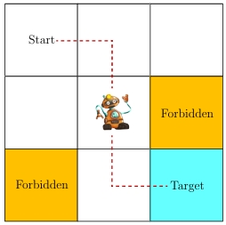
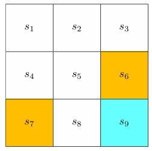
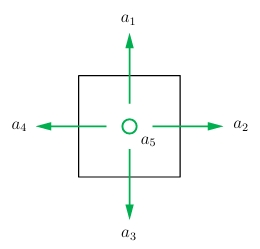
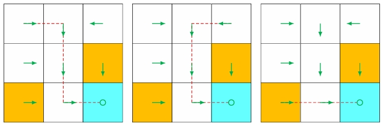
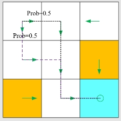
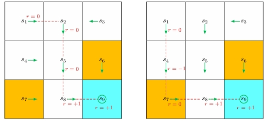

## Introduction

本笔记参考西湖大学赵世钰老师的强化学习课程，[github链接](https://github.com/MathFoundationRL/Book-Mathematical-Foundation-of-Reinforcement-Learning)。

## Grid World

课程始终以grid world作为例子介绍强化学习，具体而言，一个机器人(agent)在网格世界中自由地移动，目的是从一个给定的初始位置，找到一条"最好"的路径达到目标位置(蓝色)，中途会遇到一些障碍物(黄色)。

那么如何定义路径的好坏呢？一条好的路径应该避免撞墙，碰到障碍物，以及不要重复之前走过的路。如果agent知道网格的地图，那么它找到最优路径是非常容易的，但实际情况往往相反，agent难以直接对周围环境的全貌有清晰的认识。因此agent必须与环境进行交互，通过试验不断地感知和了解环境，进而做出较好的判断。为此，我们介绍agent与环境交互的一些概念。

## State and Action

**State:** 表示agent在环境中的状态，在grid world中指的是它的位置，记为`$s_i$`。

**State Space:** 所有的状态集合`$\mathcal{S}=\{s_i\}_{i=1}^{9}$`。

**Action:** 表示agent在某个状态下采取的行动，记为`$a_i$`。

-   `$a_1$`: 向上
-   `$a_2$`: 向右
-   `$a_3$`: 向下
-   `$a_4$`: 向左
-   `$a_5$`: 原地不动

**Action Space of a State:** 某个状态下所有可能的行动集合，记为`$\mathcal{A}(s_i)=\{a_i\}_{i=1}^5$`。

不同的state有不同的action space，例如在state `$s_1$`，agent只能向右，向下或者原地不动，那么`$\mathcal{A}(s_1)=\{a_2,a_3,a_5\}$`。本笔记考虑一般情形，`$\mathcal{A}(s_i)=\{a_i\}_{i=1}^5$`。

## State Transition

当采取某个行动，agent会从一个状态转移到另一个状态，这称为**state transition**，它定于了agent与环境的交互行为。例如

`$$s_1 \stackrel{a_2}{\longrightarrow} s_2, s_1 \xrightarrow{a_1} s_1.$$`

我们可以定义很多种state transition，例如

-   可以进入障碍物区域，但agent会得到一些惩罚，那么`$s_5 \xrightarrow{a_2} s_6$`。

-   无法进入障碍物区域，那么`$s_5 \xrightarrow{a_2} s_5$`。

我们考虑第一种定义方式，这种方式的应用更加广泛和符合实际。

State transition这个过程也可以用表格表示，但这种方式只能够表示确定性情况。在数学上可以用概率来表达，例如`$p(s_2|s_1,a_2)=1,p(s_i|s_1,a_2)=0(\forall i \neq 2)$`。

在大多数时候，agent在某个state采取某个action时，有多种可能的结果，因此可以使用条件概率来描述这种随机情形。例如，`$p(s_2|s_1,a_2)=0.9,p(s_4|s_1,a_2)=0.1$`。

## Policy and Reward

**Policy:** 告诉agent在某个状态应该采取什么行动，不同的policy确定不同的路径。

在数学上，policy可以用条件概率来表达。对于state `$s_1$`，一个确定性policy可以写成

`$$\pi(a_2|s_1)=1,\pi(a_i|s_1)=0(\forall i \neq 2).$$`

对于一个随机policy，

`$$\pi(a_2|s_1)=0.5,\pi(a_3|s_1)=0.5, 0 \ \text{for others}.$$`

**Reward:** 采取一个action后得到的一个实数值，一般而言，正数表示采取该行动获得的奖励，负数表示惩罚。

Reward实际上是人与agent交互的手段，用于引导agent朝着预期的方向发展。我们可以设计如下reward：

- 如果agent往边界走，`$r_{\text{bound}}=-1$`。
- 如果agent走进障碍物区域，`$r_{\text{forbid}}=-1$`。
- 如果agent到达目标，`$r_{\text{target}}=1$`。
- 其余情况，`$r=0$`。

通过这种reward设计，agent就会尽量避免走出网格或者走进障碍物区域。

Reward由agent当前的state和action决定，而不取决于下一步的state，例如原地不动和撞墙的下一步state相同，但reward不同。reward可以用条件概率来表达，对于确定性情况，`$p(r=-1|s_1,a_1)=1,p(r \neq -1|s_1,a_1)=0$`。

## Trajectory, Return and Episode

**Trajectory:** 是一个state-action-reward chain：
`$$s_1 \xrightarrow[r=0]{a_2} s_2 \xrightarrow[r=0]{a_3} s_5 \xrightarrow[r=0]{a_3} s_8 \xrightarrow[r=1]{a_2} s_9, $$`

`$$s_1 \xrightarrow[r=0]{a_3} s_4 \xrightarrow[r=-1]{a_3} s_7 \xrightarrow[r=0]{a_2} s_8 \xrightarrow[r=+1]{a_2} s_9.$$`

**Return:** 对于一个trajectory，return是其所有的reward之和：
`$$\text{return}=0+0+0+1=1, $$`

`$$\text{return}=0-1+0+1=0.$$`

不同的policy决定不同的trajectory，根据trajectory对应的return来判断policy的好坏。显然上述第一个trajectory更好，因为它没有进入障碍区域，从数学上来解释，它有更大的return。

一个trajectory有时是无穷的，例如当到达目的地后一直原地踏步，那么`$\text{return} \rightarrow \infty$`，这是不合理的。因此可以引入一个discount rate `$\gamma \in [0,1)$`，则discounted return为

`$$\begin{aligned}
\text{discounted return}&=0+\gamma 0+\gamma^2 0+\gamma^3 1+\gamma^4 1+\gamma^5 1+\cdots \\
&=\gamma^3(1+\gamma+\gamma^2+\cdots) \\
&=\gamma^3 \frac{1}{1-\gamma}.
\end{aligned}$$`

如果`$\gamma$`接近于0，模型更加关注前面的action；如果`$\gamma$`接近于1，模型则更加关注未来的action。

**Episode:** Agent按照某个policy与环境进行交互，最终停在某个terminal state，这个
有限长度的trajectory称为episode,这样的任务称为episodic task。如果不存在terminal state，则称为continuing task。

我们可以通过一种统一的方式来处理这两种任务：

- 1.将terminal state看作一个absorbing state，当agent到达时，使其原地踏步，并设置reward为0。

- 2.将terminal state看作一个普通的state，当agent到达时，获得reward为1，并且仍有可能跳出terminal state，以避免局部最优解。本课程使用这种方式。

## Markov Decision Process (MDP)

马尔可夫决策过程(Markov Decision Process, MDP)是一个描述随机动力系统的通用框架，agent在与环境交互时也具有随机性，因此强化学习也可以使用MDP框架，它的主要成分有：

- **集合(Sets)：**
  - **State Space:** 所有state的集合，记为`$\mathcal{S}$`。
  - **Action Space:** 某个state的action集合，记为`$\mathcal{A}(s),s \in \mathcal{S}$`。
  - **Reward Set:** 某个state执行某个action的reward，记为`$\mathcal{R}(s,a),s \in \mathcal{S}, a \in \mathcal{A}(s)$`。
- **模型(Model)：**
  - **State Transition Probability:** 在state `$s$`采取action `$a$`到达state `$s'$`的概率为`$p(s'|s,a)$`，需要满足`$\sum_{s' \in \mathcal{S}} p(s'|s,a)=1, \forall (s,a)$`。
  - **Reward Probability:** 在state `$s$`采取action `$a$`获得reward `$r$`的概率为`$p(r|s,a)$`，需要满足`$\sum_{r \in \mathcal{R}(s,a)} p(r|s,a)=1, \forall (s,a)$`。
- **策略(policy)：** 在state `$s$`采取action `$a$`的概率为`$\pi(a|s)$`，需要满足`$\sum_{a \in \mathcal{A}(s)} \pi(a|s)=1, \forall s \in \mathcal{S}$`。
- **马尔可夫性(Markov Property)：** 下一步的state和reward只与当前的state和action有关，即

`$$p(s_{t+1}|a_t,s_t,\cdots,a_0,s_0)=p(s_{t+1}|s_t,a_t),$$`

`$$p(r_{t+1}|a_t,s_t,\cdots,a_0,s_0)=p(r_{t+1}|s_t,a_t).$$`

当确定一个policy后，Markov decision process就变为Markov process。MP中每一个state的action是确定的，而MDP中每一个state有多种action的可能。

## Summary

强化学习是agent与环境不断交互的过程。Agent是一个可以感知state、维护policy和执行action的决策者。Agent执行action会改变state，同时获得相应的reward，reward指导agent再执行action，不断循环这个过程。
