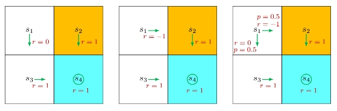
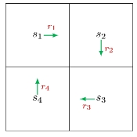

## Caculation of Return

### By Definition

**Return** 是一个 trajectory 所有 reward 的 discounted 和，可以用于量化一个 policy 的好坏。下图是从 state \(s_1\)出发的三种策略，下面我们分别计算它们的 return。

- 对于第一个 policy，它的 trajectory 是 \(s_1 \rightarrow s_3 \rightarrow s_4 \rightarrow s_4 \cdots\)，对应的 discounted return 为

  $$\begin{aligned}\text{return}_1&=0+\gamma 1+\gamma^2 1+\dots \\
&=\gamma(1+\gamma+\gamma^2+\cdots) \\
&=\frac{\gamma}{1-\gamma}.\end{aligned}$$

- 对于第二个 policy，它的 trajectory 是 \(s_1 \rightarrow s_2 \rightarrow s_4 \rightarrow s_4 \cdots\)，对应的 discounted return 为

  $$\begin{aligned}\text{return}_2&=-1+\gamma 1+\gamma^2 1+\dots \\
&=-1+\gamma(1+\gamma+\gamma^2+\cdots) \\
&=-1+\frac{\gamma}{1-\gamma}.\end{aligned}$$

- 对于第三个 policy，它的 trajectory 是 \(s_1 \rightarrow s_3 \rightarrow s_4 \rightarrow s_4 \cdots\) 和 \(s_1 \rightarrow s_2 \rightarrow s_4 \rightarrow s_4 \cdots\)，对应的 discounted return 为

  $$\begin{aligned}
\text{return}_3&=0.5(-1+\frac{\gamma}{1-\gamma})+0.5(\frac{\gamma}{1-\gamma}) \\
&=-0.5+\frac{\gamma}{1-\gamma}.
\end{aligned}$$

严格来说，\(\text{return}_3\) 是后续要介绍的 state value，因为 return 是针对某一个 trajectory 来定义的。

可以发现，\(\text{return}_1>\text{return}_3>\text{return}_2\)，因此第一个 policy 最好，第二个 policy 最差。

### By Bootstrapping

前面计算 return 的方式是直接通过定义来计算，下面以一个没有目标区域的例子介绍另一种基于 bootstrapping 的计算方式。

设 \(v_i\) 表示从 state \(s_i\) 出发得到的 return，由图可知当前 state 的 return 依赖于其他 state 的 return，那么 return 的计算方式可以写为

$$\begin{aligned}
v_1 &= r_1 + \gamma r_2 + \gamma^2 r_3 + \cdots = r_1 + \gamma (r_2 + \gamma r_3 + \cdots) = r_1 + \gamma v_2, \\
v_2 &= r_2 + \gamma r_3 + \gamma^2 r_4 + \cdots = r_2 + \gamma (r_3 + \gamma r_4 + \cdots) = r_2 + \gamma v_3, \\
v_3 &= r_3 + \gamma r_4 + \gamma^2 r_1 + \cdots = r_3 + \gamma (r_4 + \gamma r_1 + \cdots) = r_3 + \gamma v_4, \\
v_4 &= r_4 + \gamma r_1 + \gamma^2 r_2 + \cdots = r_4 + \gamma (r_1 + \gamma r_2 + \cdots) = r_4 + \gamma v_1.
\end{aligned}$$

将上述方程写成矩阵形式：

$$
\underbrace{
\begin{bmatrix}
v_1 \\
v_2 \\
v_3 \\
v_4
\end{bmatrix}
}_{\mathbf{v}}=
\begin{bmatrix}
r_1 \\
r_2 \\
r_3 \\
r_4
\end{bmatrix}+
\begin{bmatrix}
\gamma v_2 \\
\gamma v_3 \\
\gamma v_4 \\
\gamma v_1
\end{bmatrix}=
\underbrace{
\begin{bmatrix}
r_1 \\
r_2 \\
r_3 \\
r_4
\end{bmatrix}
}_{\mathbf{r}}+ \gamma
\underbrace{
\begin{bmatrix}
0 & 1 & 0 & 0 \\
0 & 0 & 1 & 0 \\
0 & 0 & 0 & 1 \\
1 & 0 & 0 & 0
\end{bmatrix}
}_{\mathbf{P}}
\underbrace{
\begin{bmatrix}
v_1 \\
v_2 \\
v_3 \\
v_4
\end{bmatrix}
}_{\mathbf{v}},
$$

进而
$$\mathbf{v}=\mathbf{r}+\gamma \mathbf{P}\mathbf{v} \Rightarrow \mathbf{v}=(\mathbf{I}-\gamma \mathbf{P})^{-1}\mathbf{r}.$$

这就是该简单例子的贝尔曼公式（Bellman Equation），它揭示了贝尔曼公式的核心思想：一个 state 的 return 依赖于其余 state 的 return。

## State Value

上一节介绍的 return 只能够用于计算确定性问题，没有融入随机性，而 agent 从一个 state 出发采取某个 action，下一个 state 有多种可能的结果。例如本文最开始的图中的第三个 policy，在初始点 state \(s_1\)，有 0.5 概率向右，0.5 概率向下，一个简单的方法就是取均值，这也是第一节计算 return 的方法。

下面我们形式化地将随机性引入计算过程，进而介绍 state value。

在时刻 \(t\)，agent 处于 state \(S_t\)，依据 policy \(\pi\) 采取 action \(A_t\)，达到下一个 state \(S_{t+1}\)，同时获得 reward\(R_{t+1}\)，这整个过程可以写为

$$S_t \xrightarrow{A_t} R_{t+1}, S_{t+1},$$

其中，\(S_t,A_t,R_{t+1}\) 都是随机变量，\(S_t, S_{t+1} \in \mathcal{S}, A_t \in \mathcal{A}(S_t), R_{t+1} \in \mathcal{R}(S_t,A_t)\)。

上述过程由以下概率分布确定：

- \(S_t \rightarrow A_t\)由\(\pi(A_t=a|S_t=s)\) 决定，表示某个 state 采取某个 action 的概率。
- \(S_t,A_t \rightarrow R_{t+1}\)由\(p(R_{t+1}=r|S_t=s,A_t=a)\) 决定，表示某个 state 采取某个 action 后获得某个 reward 的概率。
- \(S_t,A_t \rightarrow S_{t+1}\)由\(p(S_{t+1}=s'|S_t=s,A_t=a)\) 决定，表示某个 state 采取某个 action 后变成另一个 state 的概率。

进而我们可以得到一个多步的 trajectory：

$$S_t \xrightarrow{A_t} R_{t+1}, S_{t+1} \xrightarrow{A_{t+1}} R_{t+2}, S_{t+2} \xrightarrow{A_{t+2}} R_{t+3},\cdots$$

这个 trajectory 的 discounted return 为

$$G_t=R_{t+1}+\gamma R_{t+2}+\gamma^2 R_{t+3}+\cdots$$

**State Value** 定义为 \(G_t\) 的期望：

$$v_{\pi}(s)=\mathbb{E}[G_t|S_t=s].$$

- \(v_{\pi}(s)\) 是 state \(s\)的函数，从不同的 state \(s\) 出发，得到的 trajectory 不同，那么 state value 也不同。并且它依赖于 policy \(\pi\)，因为不同的 policy 确定不同的 trajectory，从而得到不同的 state value。
- \(v_{\pi}(s)\) 表示一个 state 的价值，如果 state value 很大，就表明对应的 policy 很好。
- \(v_{\pi}(s)\) 与 \(t\) 无关，当 policy 确定后，\(v_{\pi}(s)\) 也确定了。
- Return 是针对单个 trajectory 来求的，而 state value 是根据多个 trajectory 求得的 return 取平均值，因此当 \(\pi(a|s),p(r|s,a),p(s'|s,a)\) 是确定性的，那么 state value 和 return 是相同的。

实际情况往往是具有随机性的，因此用 state value 来评判 policy 的好坏是比 return 更好的。

## Bellman Equation

### Elementwise Form

考虑一个随机 trajectory：

$$S_t \xrightarrow{A_t} R_{t+1}, S_{t+1} \xrightarrow{A_{t+1}} R_{t+2}, S_{t+2} \xrightarrow{A_{t+2}} R_{t+3},\cdots$$

它的 return 可以写为

$$\begin{aligned}
G_t&=R_{t+1}+\gamma R_{t+2}+\gamma^2 R_{t+3}+\cdots \\
&=R_{t+1}+\gamma(R_{t+2}+\gamma R_{t+3}+\cdots) \\
&=\underbrace{R_{t+1}}_{\text{immediate rewards}}+\gamma \underbrace{G_{t+1}}_{\text{future rewards}}.
\end{aligned}$$

进而 state value 可以写为

$$\begin{aligned}
v_{\pi}(s)&=\mathbb{E}[G_t|S_t=s] \\
&=\mathbb{E}[R_{t+1}+\gamma G_{t+1}|S_t=s] \\
&=\mathbb{E}[R_{t+1}|S_t=s]+\gamma \mathbb{E}[G_{t+1}|S_t=s].
\end{aligned}$$

第一项为 immediate rewards 的均值：

$$\begin{aligned}
\mathbb{E}[R_{t+1} | S_t = s] &= \sum_{a \in \mathcal{A}(s)} \pi(a|s) \mathbb{E}[R_{t+1} | S_t = s, A_t = a] \\
&= \sum_{a \in \mathcal{A}(s)} \pi(a|s) \sum_{r \in \mathcal{R}(s,a)} p(r|s, a) r.
\end{aligned}$$

第二项为 future rewards 的均值：

$$\begin{aligned}
\mathbb{E}[G_{t+1} | S_t = s] &= \sum_{s' \in \mathcal{S}} \mathbb{E}[G_{t+1} | S_t = s, S_{t+1} = s'] p(s' | s) \\
&= \sum_{s' \in \mathcal{S}} \mathbb{E}[G_{t+1} | S_{t+1} = s'] p(s' | s) \\
&= \sum_{s' \in \mathcal{S}} v_{\pi}(s') p(s' | s) \\
&= \sum_{s' \in \mathcal{S}} v_{\pi}(s') \sum_{a \in \mathcal{A}(s)} p(s' | s, a) \pi(a | s).
\end{aligned}$$

上述两项的推导使用了重期望公式和马尔可夫性，结合这两项可以得到 Bellman equation：

$$\begin{aligned}
\textcolor{blue}{v_{\pi}(s)}&=\mathbb{E}[R_{t+1}|S_t=s]+\gamma \mathbb{E}[G_{t+1}|S_t=s] \\
&=\underbrace{\sum_{a \in \mathcal{A}(s)} \pi(a|s) \sum_{r \in \mathcal{R}(s,a)} p(r|s, a) r}_{\text{mean of immediate rewards}}+\underbrace{\gamma \sum_{a \in \mathcal{A}(s)} \pi(a | s) \sum_{s' \in \mathcal{S}} p(s' | s, a) \textcolor{blue}{v_{\pi}(s')}}_{\text{mean of future rewards}} \\
&=\sum_{a \in \mathcal{A}(s)} \pi(a|s) \left[ \sum_{r \in \mathcal{R}(s,a)} p(r|s,a)r + \gamma \sum_{s' \in \mathcal{S}} p(s'|s,a)\textcolor{blue}{v_{\pi}(s')} \right], \quad \forall s \in \mathcal{S}.
\end{aligned}$$

- 它描述了不同的 state 的 state-value function 之间的关系，\(v_{\pi}(s)\)和\(v_{\pi}(s')\)。
- 它包含 immediate rewards 和 future rewards 两项。
- \(v_{\pi}(s)\) 和 \(v_{\pi}(s')\) 是需要计算的值，Bellman equation 一共有 \(|\mathcal{S}|\) 个方程，可以用第一节的 Bootstrapping 方法求解。
- \(\pi(a|s)\) 是一个给定的 policy，求解 Bellman equation 可以得到不同 state 的 state value，因此解 Bellman equation 评估 policy 的过程。
- \(p(r|s,a)\) 和  \(p(s'|s,a)\) 表示这个系统模型，模型可能是已知也可能是未知的，后续会针对这两种情况给出对应的求解方法。

### Matrix-Vector Form

由上一节可知，Bellman equation 的 elementwise form 为

$$
\textcolor{blue}{v_{\pi}(s)}=\sum_{a \in \mathcal{A}(s)} \pi(a|s) \left[ \sum_{r \in \mathcal{R}(s,a)} p(r|s,a)r + \gamma \sum_{s' \in \mathcal{S}} p(s'|s,a)\textcolor{blue}{v_{\pi}(s')} \right], \quad \forall s \in \mathcal{S}.
$$

上式一共有 \(|\mathcal{S}|\) 个方程，下面我们将其简洁地写成 matrix-vector form。

首先将其改写为
$$
\textcolor{blue}{v_{\pi}(s)}=r_{\pi}(s) + \gamma \sum_{s' \in \mathcal{S}} p_{\pi}(s'|s)\textcolor{blue}{v_{\pi}(s')}, \quad \forall s \in \mathcal{S},
$$

其中，\(r_{\pi}(s)\) 是 immediate rewards 的均值，\(p_{\pi}(s'|s)\) 是在 policy \(\pi\) 下由 state \(s\) 转变为 state \(s'\) 的概率：

$$
r_{\pi}(s)=\sum_{a \in \mathcal{A}(s)} \pi(a|s) \sum_{r \in \mathcal{R}(s,a)} p(r|s,a)r, \quad p_{\pi}(s'|s)=\sum_{a \in \mathcal{A}(s)} p(s' | s, a) \pi(a | s).
$$

假设 state space 为 \(\mathcal{S}=\{s_i\}_{i=1}^n\)，则 \(n\) 个 Bellman equation 为

$$
\textcolor{blue}{v_{\pi}(s_i)}=r_{\pi}(s_i) + \gamma \sum_{s_j \in \mathcal{S}} p_{\pi}(s_j|s_i)\textcolor{blue}{v_{\pi}(s_j)}, \quad i=1,2,\cdots,n.
$$

将所有方程结合起来写成 matrix-vector form 为

$$
\mathbf{v}_{\pi}=\mathbf{r}_{\pi} + \gamma \mathbf{P}_{\pi} \mathbf{v}_{\pi},
$$

其中，

- \(\mathbf{v}_{\pi}=[v_{\pi}(s_1),\cdots,v_{\pi}(s_n)]^{T} \in \mathbb{R}^n.\)
- \(\mathbf{r}_{\pi}=[r_{\pi}(s_1),\cdots,r_{\pi}(s_n)]^{T} \in \mathbb{R}^n.\)
- \(\mathbf{P}_{\pi} \in \mathbb{R}^{n \times n}\)是 state transition matrix，\((\mathbf{P}_{\pi})_{ij}=p_{\pi}(s_j|s_i).\)

写成具体的矩阵形式为

$$
\underbrace{
\begin{bmatrix}
v_{\pi}(s_1) \\
v_{\pi}(s_2) \\
\vdots \\
v_{\pi}(s_n)
\end{bmatrix}
}_{\mathbf{v}_{\pi}}=
\underbrace{
\begin{bmatrix}
r_{\pi}(s_1) \\
r_{\pi}(s_2) \\
\vdots \\
r_{\pi}(s_n)
\end{bmatrix}
}_{\mathbf{r}_{\pi}}+ \gamma
\underbrace{
\begin{bmatrix}
p_{\pi}(s_1|s_1) & \cdots & p_{\pi}(s_{n-1}|s_1) & p_{\pi}(s_n|s_1) \\
p_{\pi}(s_1|s_2) & \cdots & p_{\pi}(s_{n-1}|s_2) & p_{\pi}(s_n|s_2) \\
\vdots & \ddots & \vdots & \vdots \\
p_{\pi}(s_1|s_n) & \cdots & p_{\pi}(s_{n-1}|s_n) & p_{\pi}(s_n|s_n)
\end{bmatrix}
}_{\mathbf{P}_{\pi}}
\underbrace{
\begin{bmatrix}
v_{\pi}(s_1) \\
v_{\pi}(s_2) \\
\vdots \\
v_{\pi}(s_n)
\end{bmatrix}
}_{\mathbf{v}_{\pi}},
$$

\(\mathbf{P}_{\pi}\) 有两个特点：

- 所有元素非负。
- 行和为 1。

### Solving the Bellman Equation

Bellman equation 的 matrix-vector form 为

$$\mathbf{v}_{\pi}=\mathbf{r}_{\pi} + \gamma \mathbf{P}_{\pi} \mathbf{v}_{\pi}.$$

- 求闭式解：

$$\mathbf{v}_{\pi}=(\mathbf{I} - \gamma \mathbf{P}_{\pi})^{-1} \mathbf{r}_{\pi}.$$

当 \(\mathbf{P}_{\pi}\) 规模很大时，求逆矩阵非常困难，通常需要使用一些数值方法来求解。

- 迭代求解：

$$\mathbf{v}_{k+1}=\mathbf{r}_{\pi} + \gamma \mathbf{P}_{\pi} \mathbf{v}_{k}.$$

[可以证明](https://github.com/MathFoundationRL/Book-Mathematical-Foundation-of-Reinforcement-Learning/blob/main/3%20-%20Chapter%202%20State%20Values%20and%20Bellman%20Equation.pdf)：

$$\mathbf{v}_{k} \rightarrow \mathbf{v}_{\pi}=(\mathbf{I} - \gamma \mathbf{P}_{\pi})^{-1} \mathbf{r}_{\pi}, \quad k \rightarrow \infty.$$

## Action Value

**Action value** 是指在某个 state 下采取某个 action 获得的平均 return，

$$q_{\pi}(s, a) = \mathbb{E}[G_t | S_t = s, A_t = a].$$

- \(q_{\pi}(s, a)\) 是 state-action pair\((s,a)\) 的函数。
- \(q_{\pi}(s, a)\) 依赖于 policy \(\pi\)。

state value 和 action value 都是关于 return 的期望，它们之间有什么关系呢？

- 根据条件期望的性质，state value 可以写为

$$
\underbrace{\mathbb{E}[G_t | S_t = s]}_{v_{\pi}(s)} = \sum_{a \in \mathcal{A}(s)} \underbrace{\mathbb{E}[G_t | S_t = s, A_t = a]}_{q_{\pi}(s,a)} \pi(a | s).
$$

因此

$$\begin{equation}\label{eq:1}
\textcolor{blue}{v_{\pi}(s)} = \sum_{a \in \mathcal{A}(s)} \pi(a | s) \textcolor{blue}{q_{\pi}(s, a)}.
\end{equation}$$

- 由 Bellman equation 可知，

$$
\textcolor{blue}{v_{\pi}(s)}=\sum_{a \in \mathcal{A}(s)} \pi(a|s) \left[ \sum_{r \in \mathcal{R}(s,a)} p(r|s,a)r + \gamma \sum_{s' \in \mathcal{S}} p(s'|s,a)\textcolor{blue}{v_{\pi}(s')} \right].
$$

结合前式可得

$$\begin{equation}\label{eq:2}
\textcolor{blue}{q_{\pi}(s, a)}=\sum_{r \in \mathcal{R}(s,a)} p(r|s,a)r + \gamma \sum_{s' \in \mathcal{S}} p(s'|s,a)\textcolor{blue}{v_{\pi}(s')}.
\end{equation}$$

式 (\(\ref{eq:1}\)) 和式 (\(\ref{eq:2}\)) 像是硬币的正反面，式 (\(\ref{eq:1}\)) 说明可以由 action value 求出 state value，式 (\(\ref{eq:2}\)) 说明可以由 state value 求出 action value。
