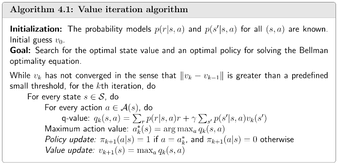
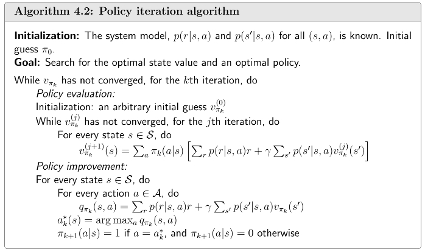
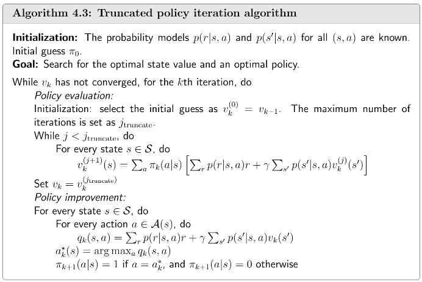
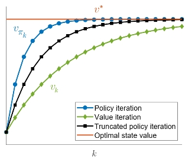

## Value Iteration Algorithm

[上一节](/blog/rl-3-bellman-optimality-equation/)介绍了求 Bellman optimality equation（BOE） 的迭代算法：

$$\mathbf{v}_{k+1}=f(\mathbf{v}_k)=\max_{\pi} (\mathbf{r}_{\pi} + \gamma \mathbf{P}_{\pi} \mathbf{v}_k), \quad k=1,2,3,\cdots$$

这个算法称为值迭代算法（Value Iteration Algorithm），可以分为两步：

- Policy update：

$$\pi_{k+1}=\arg\max_{\pi}(\mathbf{r}_{\pi}+\gamma \mathbf{P}_{\pi}\mathbf{v}_k).$$

- Value update：

$$\mathbf{v}_{k+1}=\mathbf{r}_{\pi_{k+1}}+\gamma \mathbf{P}_{\pi_{k+1}}\mathbf{v}_k.$$

其中，**\(\mathbf{v}_k\) 并不是一个 state value，因为它不一定满足 Bellman equation。**

上述算法流程用的是 matrix-vector form，为了方便实现算法，我们介绍对应的 elementwise form：

- Policy update：

\(\pi_{k+1}=\arg\max_{\pi}(\mathbf{r}_{\pi}+\gamma \mathbf{P}_{\pi}\mathbf{v}_k)\) 的 elementwise form 是

$$\pi_{k+1}(s) = \arg\max_{\pi} \sum_{a \in \mathcal{A}(s)} \pi(a|s) \underbrace{\left( \sum_{r \in \mathcal{R}(s,a)} p(r|s,a)r + \gamma \sum_{s' \in \mathcal{S}} p(s'|s,a)v_k(s') \right)}_{q_k(s,a)}, \quad \forall s \in \mathcal{S}.$$

该优化问题的最优解为

$$\pi_{k+1}(a|s) = \left\{
\begin{array}{ll}
1 & a = a_k^*(s) \\
0 & a \neq a_k^*(s)
\end{array}
\right., \quad a_k^*(s) = \arg\max_a q_k(s, a).$$

- Value update：

\(\mathbf{v}_{k+1}=\mathbf{r}_{\pi_{k+1}}+\gamma \mathbf{P}_{\pi_{k+1}}\mathbf{v}_k\)的elementwise form是

$$v_{k+1}(s) = \sum_{a \in \mathcal{A}(s)} \pi_{k+1}(a|s) \underbrace{\left( \sum_{r \in \mathcal{R}(s,a)} p(r|s,a)r + \gamma \sum_{s' \in \mathcal{S}} p(s'|s,a)v_k(s') \right)}_{q_k(s,a)}, \quad \forall s \in \mathcal{S}.$$

根据 [BOE](/blog/rl-3-bellman-optimality-equation/) 的求解思想可知

$$v_{k+1}(s) = \max_a q_k(a,s).$$

综上，值迭代算法的伪代码如下：

$$v_k(s) \rightarrow q_k(s, a) \rightarrow \text{greedy policy } \pi_{k+1}(a|s) \rightarrow \text{new value } v_{k+1} = \max_a q_k(s, a).$$

## Policy Iteration Algorithm

值迭代算法是根据给定的 value，先更新 policy，再以此更新 value。而策略迭代算法则是根据给定的 policy，先更新 state value，再依此更新 policy，具体迭代步骤如下：

- Policy evaluation：
$$\mathbf{v}_{\pi_{k}}=\mathbf{r}_{\pi_{k}}+\gamma \mathbf{P}_{\pi_{k}}\mathbf{v}_k.$$

- Policy improvement：

$$\pi_{k+1}=\arg\max_{\pi}(\mathbf{r}_{\pi}+\gamma \mathbf{P}_{\pi}\mathbf{v}_{\pi_{k}}).$$

再求解这个算法之前，我们需要回答一些重要的问题：

**Q1：** 在 policy evaluation 中，如何求解 state value \(v_{\pi_k}\)？

state value 可以通过求解 [Bellman equation](/blog/rl-2-bellman-equation/) 得到，主要有两种方法：

- 求闭式解：

$$\mathbf{v}_{\pi_k}=(\mathbf{I} - \gamma \mathbf{P}_{\pi_k})^{-1} \mathbf{r}_{\pi_k}.$$

- 迭代求解：

$$\mathbf{v}_{\pi_k}^{(j+1)}=\mathbf{r}_{\pi_k} + \gamma \mathbf{P}_{\pi_k} \mathbf{v}_{\pi_k}^{(j)}, \quad j=0,1,2,\cdots$$

也就是说，策略迭代算法是一个包含另一个求解 Bellman equation 迭代算法的迭代算法。

**Q2：** 在 policy improvement 中，为什么新的 policy \(\pi_{k+1}\) 比旧的 policy \(\pi_{k}\) 要好？

[可以证明](https://github.com/MathFoundationRL/Book-Mathematical-Foundation-of-Reinforcement-Learning/blob/main/3%20-%20Chapter%204%20Value%20Iteration%20and%20Policy%20Iteration.pdf)，如果 \(\pi_{k+1}=\arg\max_{\pi}(\mathbf{r}_{\pi}+\gamma \mathbf{P}_{\pi}\mathbf{v}_{\pi_{k}})\)，那么 \(\mathbf{v}_{\pi_{k+1}} \geq \mathbf{v}_{\pi_k}, \forall k\)。

**Q3：** 为什么这个迭代算法最终可以到达一个最优 policy？

由Q2可知，每一次迭代都可以提升policy，[可以证明](https://github.com/MathFoundationRL/Book-Mathematical-Foundation-of-Reinforcement-Learning/blob/main/3%20-%20Chapter%204%20Value%20Iteration%20and%20Policy%20Iteration.pdf)，state value序列 \(\{v_{\pi_k}\}_{k=0}^{\infty}\) 会收敛到 optimal state value \(\mathbf{v}^*\)，同样 policy 序列 \(\{\pi\}_{k=0}^{\infty}\) 会收敛到 optimal policy \(\pi^*\)：

$$\mathbf{v}_{\pi_0} \leq \mathbf{v}_{\pi_1} \leq \mathbf{v}_{\pi_2} \leq \cdots \leq \mathbf{v}_{\pi_k} \leq \cdots \leq \mathbf{v}^*.$$

和值迭代算法一样，我们介绍策略迭代算法的 elementwise form：

- Policy evaluation

\(\mathbf{v}_{\pi_k}^{(j+1)}=\mathbf{r}_{\pi_k} + \gamma \mathbf{P}_{\pi_k} \mathbf{v}_{\pi_k}^{(j)}\) 的 elementwise form 为

$$v_{\pi_k}^{(j+1)}(s) = \sum_{a \in \mathcal{A}(s)} \pi_{k}(a|s) \left( \sum_{r \in \mathcal{R}(s,a)} p(r|s,a)r + \gamma \sum_{s' \in \mathcal{S}} p(s'|s,a)v_{\pi_k}^{(j)}(s') \right), \quad \forall s \in \mathcal{S}.$$

当 \(j \rightarrow \infty\) 或者 \(j\) 超过某个设定值或者 \(\Vert v_{\pi_k}^{(j+1)}-v_{\pi_k}^{(j)} \Vert\) 小于某个设定值时迭代停止。

- Policy improvement

\(\pi_{k+1}=\arg\max_{\pi}(\mathbf{r}_{\pi}+\gamma \mathbf{P}_{\pi}\mathbf{v}_{\pi_{k}})\) 的 elementwise form 为

$$\pi_{k+1}(s) = \arg\max_{\pi} \sum_{a \in \mathcal{A}(s)} \pi(a|s) \underbrace{\left( \sum_{r \in \mathcal{R}(s,a)} p(r|s,a)r + \gamma \sum_{s' \in \mathcal{S}} p(s'|s,a)v_{\pi_k}(s') \right)}_{q_{\pi_k}(s,a)}, \quad \forall s \in \mathcal{S}.$$

该优化问题的最优解为

$$\pi_{k+1}(a|s) = \left\{
\begin{array}{ll}
1 & a = a_k^*(s) \\
0 & a \neq a_k^*(s)
\end{array}
\right., \quad a_k^*(s) = \arg\max_a q_{\pi_k}(s, a).$$

综上，策略迭代算法的伪代码如下：

$$\pi_0 \xrightarrow{PE} v_{\pi_0} \xrightarrow{PI} \pi_1 \xrightarrow{PE} v_{\pi_1} \xrightarrow{PI} \pi_2 \xrightarrow{PE} v_{\pi_2} \xrightarrow{PI} \cdots$$

## Truncated Policy Iteration Algorithm

策略迭代算法是从 \(\pi_0\) 开始，

- Policy evaluation: 
$$\mathbf{v}_{\pi_{k}}=\mathbf{r}_{\pi_{k}}+\gamma \mathbf{P}_{\pi_{k}}\mathbf{v}_k.$$

- Policy improvement: 

$$\pi_{k+1}=\arg\max_{\pi}(\mathbf{r}_{\pi}+\gamma \mathbf{P}_{\pi}\mathbf{v}_{\pi_{k}}).$$

值迭代算法是从 \(\mathbf{v}_0\) 开始，

- Policy update: 

$$\pi_{k+1}=\arg\max_{\pi}(\mathbf{r}_{\pi}+\gamma \mathbf{P}_{\pi}\mathbf{v}_k).$$

- Value update: 

$$\mathbf{v}_{k+1}=\mathbf{r}_{\pi_{k+1}}+\gamma \mathbf{P}_{\pi_{k+1}}\mathbf{v}_k.$$

现在我们对比这两个算法：

|            | 策略迭代 | 值迭代 | 分析 |
|------------|----------------------------|----------------------------|----------|
| 1) Policy：| \(\pi_0\)                  | N/A                        |          |
| 2) Value： | \(\mathbf{v}_{\pi_0} = \mathbf{r}_{\pi_0} + \gamma \mathbf{P}_{\pi_0} \mathbf{v}_{\pi_0}\) | \(\textcolor{red}{\mathbf{v}_0 := \mathbf{v}_{\pi_0}}\) |          |
| 3) Policy：| \(\pi_1 = \arg\max_{\pi} (\mathbf{r}_{\pi} + \gamma \mathbf{P}_{\pi} \mathbf{v}_{\pi_0})\) | \(\pi_1 = \arg\max_{\pi} (\mathbf{r}_{\pi} + \gamma \mathbf{P}_{\pi} \mathbf{v}_0)\) | 两个policy相同 |
| 4) Value： | \(\textcolor{blue}{\mathbf{v}_{\pi_1} = \mathbf{r}_{\pi_1} + \gamma \mathbf{P}_{\pi_1} \mathbf{v}_{\pi_1}}\) | \(\textcolor{blue}{\mathbf{v}_1 = \mathbf{r}_{\pi_1} + \gamma \mathbf{P}_{\pi_1} \mathbf{v}_0}\) | \(\mathbf{v}_{\pi_1} \geq \mathbf{v}_1\)因为\(\mathbf{v}_{\pi_1} \geq \mathbf{v}_{\pi_0}\) |
| 5) Policy：| \(\pi_2 = \arg\max_{\pi} (\mathbf{r}_{\pi} + \gamma \mathbf{P}_{\pi} \mathbf{v}_{\pi_1})\) | \(\pi_2' = \arg\max_{\pi} (\mathbf{r}_{\pi} + \gamma \mathbf{P}_{\pi} \mathbf{v}_1)\) |          |
| \(\vdots\)     | \(\vdots\)                         | \(\vdots\)                        | \(\vdots\)      |

- 两个算法从同一初始值出发

- 前三步是完全相同的

- 第四步开始两者开始有差异：

  - 在策略迭代中，求解 \(\mathbf{v}_{\pi_1} = \mathbf{r}_{\pi_1} + \gamma \mathbf{P}_{\pi_1} \mathbf{v}_{\pi_1}\) 需要使用一个无穷步的迭代算法。
  
  - 在值迭代中，\(\mathbf{v}_1 = \mathbf{r}_{\pi_1} + \gamma \mathbf{P}_{\pi_1} \mathbf{v}_0\) 是一个单步迭代。
  
下面是求解 \(\mathbf{v}_{\pi_1} = \mathbf{r}_{\pi_1} + \gamma \mathbf{P}_{\pi_1} \mathbf{v}_{\pi_1}\) 的迭代过程：

$$\begin{align*}
\textcolor{blue}{\mathbf{v}_{\pi_1}^{(0)}} &\textcolor{blue}{=} \textcolor{blue}{\mathbf{v}_0} \\
\text{value iteration} \leftarrow \textcolor{blue}{\mathbf{v}_1} \leftarrow \mathbf{v}_{\pi_1}^{(1)} &= \mathbf{r}_{\pi_1} + \gamma \mathbf{P}_{\pi_1} \mathbf{v}_{\pi_1}^{(0)} \\
\mathbf{v}_{\pi_1}^{(2)} &= \mathbf{r}_{\pi_1} + \gamma \mathbf{P}_{\pi_1} \mathbf{v}_{\pi_1}^{(1)} \\
&\vdots \\
\textcolor{blue}{\text{truncated policy iteration}} \leftarrow \textcolor{blue}{\bar{\mathbf{v}}_1} \leftarrow \mathbf{v}_{\pi_1}^{(j)} &= \mathbf{r}_{\pi_1} + \gamma \mathbf{P}_{\pi_1} \mathbf{v}_{\pi_1}^{(j-1)} \\
&\vdots \\
\text{policy iteration} \leftarrow \textcolor{blue}{\mathbf{v}_{\pi_1}} \leftarrow \mathbf{v}_{\pi_1}^{(\infty)} &= \mathbf{r}_{\pi_1} + \gamma \mathbf{P}_{\pi_1} \mathbf{v}_{\pi_1}^{(\infty)}
\end{align*}$$

- 值迭代算法只进行一次迭代。

- 策略迭代算法进行无穷次迭代。

- 截断策略迭代算法进行有限次迭代。

综上，截断策略迭代算法的伪代码如下：

那么采用截断策略迭代算法会不会削弱收敛性呢？答案是不会，我们有以下结论：

**Value Improvement：** 假设求解 \(\mathbf{v}_{\pi_k}^{(j+1)}=\mathbf{r}_{\pi_k} + \gamma \mathbf{P}_{\pi_k} \mathbf{v}_{\pi_k}^{(j)}\) 时的初始值为 \(\mathbf{v}_{\pi_k}^{(0)}=\mathbf{v}_{\pi_{k-1}}\)，那么有

$$\mathbf{v}_{\pi_k}^{(j+1)} \geq \mathbf{v}_{\pi_k}^{j}, \quad j=0,1,2,\cdots$$

也就是说，再 policy evaluation 这个步骤中，每迭代 1 次都会使得 value 增大。值迭代算法仅迭代 1 次，而策略迭代算法迭代无穷次，且它们均是收敛的。而截断策略迭代算法处于它们之间，也是收敛的，收敛速度快于值迭代，慢于策略迭代。

总的来说，在 policy evaluation 中不要计算一步，也不要计算无穷多步，计算一定的步数就可以减少外层循环的迭代次数。