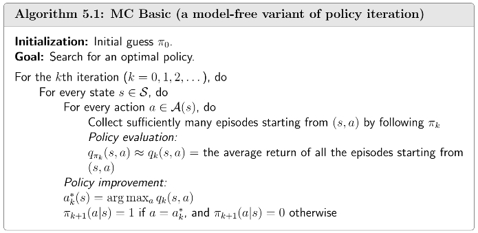
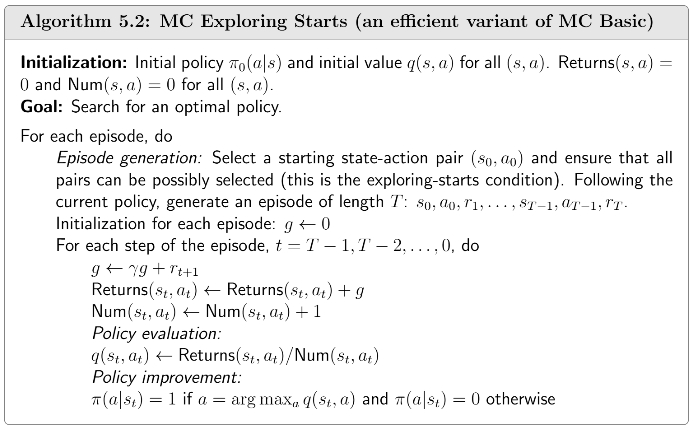
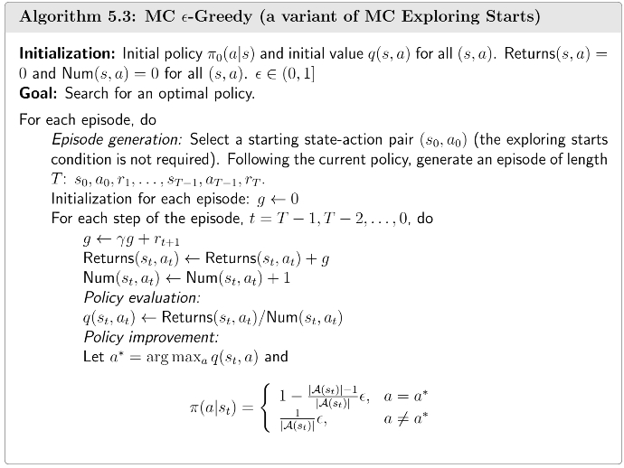

## Model-Based to Model-Free

上一节介绍的[策略迭代算法](/blog/rl-4-value-iteration-and-policy-iteration/)是基于明确的环境模型(model-based)来进行策略评估和改进的。然而在许多现实问题中，模型`$p(s'|s,a), p(r|s,a)$`不能够轻易得到，那么可以使用基于蒙特卡洛(Monte Carlo, MC)的无模型(model-free)方法进行策略的评估和改进。

回顾策略迭代算法的两个步骤：

- Policy evaluation: 

`$$\mathbf{v}_{\pi_{k}}=\mathbf{r}_{\pi_{k}}+\gamma \mathbf{P}_{\pi_{k}}\mathbf{v}_k.$$`

- Policy improvement: 

`$$\pi_{k+1}=\arg\max_{\pi}(\mathbf{r}_{\pi}+\gamma \mathbf{P}_{\pi}\mathbf{v}_{\pi_{k}}).$$`

其中policy improvement的elementwise form为

`$$\begin{aligned}
\pi_{k+1}(s) &= \arg\max_{\pi} \sum_{a \in \mathcal{A}(s)} \pi(a|s) \left( \sum_{r \in \mathcal{R}(s,a)} p(r|s,a)r + \gamma \sum_{s' \in \mathcal{S}} p(s'|s,a)v_{\pi_k}(s') \right) \\
&= \arg\max_{\pi} \sum_{a \in \mathcal{A}(s)} \pi(a|s) q_{\pi_k}(s,a), \quad \forall s \in \mathcal{S}.
\end{aligned}$$`

策略迭代算法的第一步policy evaluation计算state value的目的是用于第二步计算action value `$q_{\pi_k}(s,a)$`，因此这里最关键的部分就是求解`$q_{\pi_k}(s,a)$`，有两种方法：

- Model-based:

`$$q_{\pi_k}(s,a)=\sum_{r \in \mathcal{R}(s,a)} p(r|s,a)r + \gamma \sum_{s' \in \mathcal{S}} p(s'|s,a)v_{\pi_k}(s').$$`

- Model-free:

`$$q_{\pi_k}(s,a)=\mathbb{E}[G_t|S_t=s,A_t=a].$$`

使用model-free方法时，从任意state `$s$`出发，采取action `$a$`，根据policy `$\pi_k$`，采样多个episodes，然后使用这些episodes的return均值来估计`$q_{\pi_k}(s,a)$`：

`$$q_{\pi_k}(s,a)=\mathbb{E}[G_t|S_t=s,A_t=a] \approx \frac{1}{N} \sum_{i=1}^N g^{(i)}(s,a).$$`

其中，`$g^{(i)}(s,a)$`表示第`$i$`个episode的return。

总的来说，**没有模型就得有数据**。

## MC Basic

根据刚刚介绍的基于蒙特卡洛的model-free方法，我们可以得到MC Basic算法的步骤如下：

- Policy evaluation: 对于每一个state-action pair `$(s,a)$`，基于给定的policy `$\pi$`，生成多个episodes。进而用所有episodes的平均return来估计`$q_{\pi_k}(s,a)$`。

- Policy improvement: 这一步求解`$\pi_{k+1}(s) = \arg\max_{\pi} \sum_{a \in \mathcal{A}(s)} \pi(a|s) q_{\pi_k}(s,a), \forall s \in \mathcal{S}$`，最优policy为`$\pi_{k+1}(a_k^*|s)=1,a_k^*=\arg\max_a q_{\pi_k}(s,a)$`。

可以看到，MC Basic根据蒙特卡洛方法直接计算`$q_{\pi_k}(s,a)$`，而非通过计算state value`$v_{\pi_k}(s)$`后再计算`$q_{\pi_k}(s,a)$`，其余过程MC Basic和策略迭代算法相同。

综上，MC Basic算法的伪代码如下：

一些有趣的现象：

- Episode如果太短，那么模型探索的就不够，只有接近target的state才有非零的state value。

- 理论上Episode越长，那么`$G_t$`的估计就越准确，但一般实际情况我们取一个充分长的长度即可。

## MC Exploring Starts

MC Basic算法考虑的信息较少，且需要采样大量episodes，因此效率太低。举个简单例子，考虑如下episode：

`$$s_1 \xrightarrow {a_2} s_2 \xrightarrow {a_4} s_1 \xrightarrow {a_2} s_2 \xrightarrow {a_3} s_5 \xrightarrow {a_1} \cdots$$`

MC Basic算法的信息仅用来计算`$q_{\pi}(s_1,a_2)$`，但实际上这个episode也访问到很多其他的state-action pairs(`$q_{\pi}(s_2,a_4),q_{\pi}(s_2,a_3),q_{\pi}(s_5,a_1)$`)：

`$$\begin{align*}
s_1 \xrightarrow{a_2} s_2 \xrightarrow{a_4} s_1 \xrightarrow{a_2} s_2 \xrightarrow{a_3} &s_5 \xrightarrow{a_1} \cdots \quad \text{[original episode]} \\
s_2 \xrightarrow{a_4} s_1 \xrightarrow{a_2} s_2 \xrightarrow{a_3} &s_5 \xrightarrow{a_1} \cdots \quad \text{[episode starting from $(s_2, a_4)$]} \\
s_1 \xrightarrow{a_2} s_2 \xrightarrow{a_3} &s_5 \xrightarrow{a_1} \cdots \quad \text{[episode starting from $(s_1, a_2)$]} \\
s_2 \xrightarrow{a_3} &s_5 \xrightarrow{a_1} \cdots \quad \text{[episode starting from $(s_2, a_3)$]} \\
&s_5 \xrightarrow{a_1} \cdots \quad \text{[episode starting from $(s_5, a_1)$]}
\end{align*}$$`

因此一个episode中的所有state-action都可以作为起点而被充分利用，这就是Exploring Starts。其中包括两种方法：

- First-visit: 对于episode中的某个state-value pair `$(s_t,a_t)$`，只考虑首次访问时的return。

- Every-visit: 对于episode中的某个state-value pair `$(s_t,a_t)$`，考虑每次访问的累计return的均值。

除了上述让数据被更加高效利用之外，还可以更加高效地更新policy。MC Basic算法需要agent将所有的episodes都收集后再计算更新，我们可以利用单个episode去估计action value，这样就可以更新policy episode-by-episode。这个思想在学习[截断策略迭代算法](/blog/rl-4-value-iteration-and-policy-iteration/)时介绍过，是一种用不精确的中间结果估计来提高算法效率的方法，可以统称为Generalized Policy Iteration (GPI)。

基于MC Basic算法，利用上述的高效利用数据和高效更新policy的方法，我们得到MC Exploring Starts算法，它的伪代码如下：

总的来说，exploring starts表示我们需要为每一个state-action pair生成足够多的episodes，换句话说，每一个state-value pair被深度探索后，我们才能够精确地估计action value，进而找到最优policy。

## MC `$\varepsilon$`-Greedy

在实际应用中，经常难以收集到每一个state-value pair的episode，因为某些policy可能永远不会访问到某些state或采取某些action，我们可以引入soft policy来去除exploring starts的条件。

Soft policy是指每一个state都有概率采取所有不同的action，依赖于随机性，只要episode足够长，那么所有的`$(s,a)$`都会被访问到很多次，进而exploring starts的条件就可以去除。

常用的soft policy是`$\varepsilon$`-greedy policy：

`$$\pi(a|s) = 
\begin{cases} 
1 - \dfrac{\varepsilon}{|\mathcal{A}(s)|}(|\mathcal{A}(s)| - 1), & \text{for the greedy action,} \\
\dfrac{\varepsilon}{|\mathcal{A}(s)|}, & \text{for the other } |\mathcal{A}(s)| - 1 \text{ actions.}
\end{cases}$$`

其中，`$\varepsilon \in [0,1]$`，`$|\mathcal{A}(s)|$`是state `$s$`可以采取的action的数量。

可以看到，greedy action的概率一定大于其他action：

`$$1 - \frac{\varepsilon}{|\mathcal{A}(s)|}(|\mathcal{A}(s)| - 1) = 1 - \varepsilon + \frac{\varepsilon}{|\mathcal{A}(s)|} \geq \frac{\varepsilon}{|\mathcal{A}(s)|}.$$`

也就是说，采取最优action的概率依然是的最大的，不过其他action都有采取的可能。`$\varepsilon$`越小就越贪心，即最优action概率相比其他action大很多；`$\varepsilon$`越大就越倾向于探索，即各个action的概率趋向于均匀分布。

把`$\varepsilon$`-greedy policy嵌入到MC-based的强化学习算法，具体地，将policy improvement改为求解

`$$\pi_{k+1}(s)=\arg\max_{\pi \in \Pi_{\varepsilon}} \sum_{a \in \mathcal{A}(s)} \pi(a|s) q_{\pi_k}(s,a),$$`

其中`$\Pi_{\varepsilon}$`表示所有的`$\varepsilon$`-greedy policy。最优policy为

`$$\pi_{k+1}(a|s) = 
\begin{cases} 
1 - \dfrac{\varepsilon}{|\mathcal{A}(s)|}(|\mathcal{A}(s)| - 1), & a=a_k^* \\
\dfrac{\varepsilon}{|\mathcal{A}(s)|}, & a \neq a_k^*.
\end{cases}$$`

MC `$\varepsilon$`-Greedy除了使用`$\varepsilon$`-greedy policy进行policy improvement之外，其余步骤与MC Exploring Starts完全相同。它不需要exploring starts，但是以另一种方式访问了所有的state-action pairs。

MC `$\varepsilon$`-Greedy算法的优势是探索性很强，所有不需要exploring starts这个条件。它的劣势是仅仅在`$\Pi_{\varepsilon}$`这个policy集合中是最优的，但在`$\Pi$`中并不是最优的。当`$\varepsilon$`非常小，那么`$\Pi_{\epsilon}$`中的最优policy与`$\Pi$`的最优policy就非常接近。一个常用的方法是先设置较大的`$\varepsilon$`，让它有较强的探索能力，随着policy的更新，逐步减小`$\varepsilon$`，让其趋于0，以得到一个最优的策略。

