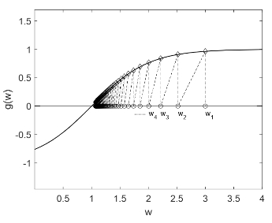

## Mean Estimation Example

在介绍[蒙特卡洛方法](/blog/rl-5-monte-carlo-learning/)时我们提到了可以用不精确的中间结果估计来提高算法效率的方法，也就是增量式更新，这样就不需要等数据全部收集完再进行参数更新。我们先以均值估计例子来回顾这个方法。

假设我们收集了随机变量`$X$`的一系列独立同分布的样本`$\{x_i\}_{i=1}^{N}$`，需要估计它的均值`$\mathbb{E}[X]$`，有两种方法：

- 用样本均值估计总体均值：

`$$\mathbb{E}[X] \approx \bar{x} = \frac{1}{N} \sum_{i=1}^{N} x_i.$$`

根据蒙特卡洛的思想，`$\bar{x} \rightarrow \mathbb{E}[X], N \rightarrow \infty$`。这种方法的缺点就是需要等所有的样本都收集完才能够进行计算，效率较低。

- 增量式迭代更新：

我们令

`$$w_{k+1}=\frac{1}{k} \sum_{i=1}^k x_i, \quad k=1,2,\cdots$$`

那么

`$$w_{k}=\frac{1}{k-1} \sum_{i=1}^{k-1} x_i, \quad k=2,3,\cdots$$`

进而`$w_{k+1}$`可以由`$w_{k}$`表达：

`$$\begin{aligned}
\textcolor{blue}{w_{k+1}}&=\frac{1}{k} \sum_{i=1}^k x_i \\
&=\frac{1}{k}\left(\sum_{i=1}^{k-1} x_i+x_k\right) \\
&=\frac{1}{k}((k-1)w_k+x_k) \\
&=\textcolor{blue}{w_k-\frac{1}{k}(w_k-x_k)}. 
\end{aligned}$$`

这种方法的优势是每得到一个样本就可以立刻进行参数更新，进而该参数就可以用到其他的任务当中去。当采样数量越来越多，估计的精确度也会越来越高，`$w_k \rightarrow \mathbb{E}[X], k \rightarrow \infty$`。

## Robbins-Monro Algorithm

### Algorithm Description

随机近似是一类使用随机迭代算法求解方程的根或者优化问题的方法，其中一个非常经典的方法就是Robbins-Monro算法。

假设我们要找到方程`$g(w)=0(w \in \mathbb{R}, g: \mathbb{R} \rightarrow \mathbb{R})$`的根，如果`$g$`的表达式或者它的导数已知，那么有很多数值方法可以求解这个方程的根，但在强化学习中`$g$`的表达式往往是未知的。例如，`$g$`可能是一个人工神经网络，它的参数是未知的，我们只能够得到`$g(w)$`的一个带有噪声的观测数据：

`$$\tilde{g}(w,\eta)=g(w)+\eta,$$`

其中，`$\eta \in \mathbb{R}$`是观测误差。也就是说，这是一个只知道输入`$w$`和带噪声输出`$\tilde{g}(w,\eta)$`的黑盒，我们的目标是使用`$w$`和`$\tilde{g}(w,\eta)$`来求解`$g(w)=0$`。

Robbins-Monro(RM)算法求解上述问题的更新公式为

`$$\begin{equation}\label{eq:1}w_{k+1}=w_{k}-a_k \tilde{g}(w_k,\eta_k), \quad k=1,2,3,\cdots\end{equation}$$`

其中：

- `$w_k$`是根的第`$k$`次估计。

- `$\tilde{g}(w_k,\eta_k)=g(w_k)+\eta_k$`是第`$k$`个含噪声的观测值。

- `$a_k>0$`是一个步长参数，控制更新幅度。

### Convergence Analysis

RM算法不需要知道`$g$`的任何信息，只需要知道输入和输出。但有一个问题是，它一定能够收敛到真实的根吗？我们先来看一个例子。

考虑`$g(w)=\tanh (w-1)$`，`$g(w)=0$`的根为`$w^*=1$`，使用公式`$\eqref{eq:1}$`进行迭代更新，参数设置为`$w_1=3,a_k=\frac{1}{k},\eta_k=0$`，最终结果如下：

`$w_k$`会收敛到真实根`$w^*=1$`，收敛情况可以有如下解释：

- 当`$w_k>w^*$`时，`$g(w_k)>0$`，那么`$w_{k+1}=w_k-a_kg(w_k)<w_k$`，所有`$w_{k+1}$`相比于`$w_k$`离真实根`$w^*$`更近。

- 当`$w_k<w^*$`时，`$g(w_k)=<0$`，那么`$w_{k+1}=w_k-a_kg(w_k)>w_k$`，所有`$w_{k+1}$`相比于`$w_k$`离真实根`$w^*$`更近。

上面的收敛性分析是直观解释，RM算法有以下严格的收敛性定理。

**RM算法收敛性定理：** 对于`$w_{k+1}=w_{k}-a_k \tilde{g}(w_k,\eta_k) (k=1,2,3,\cdots)$`，如果满足

(1) `$\forall w, 0<c_1 \leq \nabla_w g(w) \leq c_2.$`

  - `$0<c_1\leq \nabla_wg(w)$`表明`$g(w)$`是单调递增的，以确保`$g(w)=0$`的根是存在且唯一的。
  
- `$\nabla_wg(w) \leq c_2$`避免算法发散。
  
- 一个简单的应用是，将目标函数为`$J(w)$`的优化问题表述为一个求根问题`$g(w)=\nabla_w J(w)=0$`，这种情况下`$g(w)$`单调递增的条件表明`$J(w)$`是一个凸函数，这是优化问题中一个普遍采用的假设。

(2) `$\sum_{k=1}^{\infty}a_k=\infty, \sum_{k=1}^{\infty}a_k^2<\infty.$`

- `$\sum_{k=1}^{\infty}a_k^2<\infty$`确保`$a_k \rightarrow 0, k \rightarrow \infty$`，结合RM算法迭代公式`$w_{k+1}-w_{k}=-a_k \tilde{g}(w_k,\eta_k)$`可知：

  - 如果`$a_k \rightarrow 0$`，那么`$a_k \tilde{g}(w_k,\eta_k) \rightarrow 0$`，进而`$w_{k+1}-w_{k} \rightarrow 0$`。
  
  - 当`$w_k$`收敛时，有`$w_{k+1}-w_{k} \rightarrow 0$`。
  
- `$\sum_{k=1}^{\infty}a_k=\infty$`确保`$a_k \rightarrow 0, k \rightarrow \infty$`的速度不要过快。结合RM算法迭代公式`$w_{k+1}-w_{k}=-a_k \tilde{g}(w_k,\eta_k),k=1,2,\cdots$`可知：

  `$$\begin{equation}\label{eq:2}w_{\infty}-w_{1}=-\sum_{k=1}^{\infty}a_k \tilde{g}(w_k,\eta_k).\end{equation}$$`

  - 假设`$w_{\infty}=w^*$`且`$\sum_{k=1}^{\infty}a_k<\infty$`，那么`$\sum_{k=1}^{\infty}a_k \tilde{g}(w_k,\eta_k)$`可能是有界的，如果选择的初始值`$w_1$`离真实值`$w^*$`太远那么公式`$\eqref{eq:2}$`就不成立。

  - 该条件让我们放心地选择初始值`$w_1$`，在后续的更新中都能够收敛到真实值`$w^*$`。
  
- 一个常用的满足该条件的序列是`$a_k=\frac{1}{k}$`，但为了防止后续的新增数据作用越来越小，实际应用中我们常常将`$a_k$`固定为一个很小的常数，即使该条件不满足，但也是有效的。

(3) `$\mathbb{E}[\eta_k|\mathcal{H}_k]=0, \mathbb{E}[\eta_k^2|\mathcal{H}_k]<\infty.$`

- 如果误差序列`$\{\eta_k\}$`满足`$\mathbb{E}[\eta_k]=0,\mathbb{E}[\eta_k^2]<\infty$`，且是独立同分布的，自然就满足该条件。

其中`$\mathcal{H}_k=\{w_k,w_{k-1},\cdots\}$`，那么`$w_k$`[几乎必然收敛](https://math.fandom.com/zh/wiki/%E6%A6%82%E7%8E%87%E6%94%B6%E6%95%9B%E6%80%A7)到`$g(w)=0$`的根`$w^*$`。

## Stochastic Gradient Descent

### Algorithm Description

随机梯度下降(SGD)要解决的典型优化问题为

`$$\min_w \quad J(w)=\mathbb{E}[f(w,X)].$$`

其中，`$w$`是要优化的参数，`$X$`是随机变量，它们可以是标量或者向量。

求解该问题主要有三种方法：

- **Gradient Descent(GD)**

  - GD是一种经典的优化方法，根据梯度进行参数更新：

  `$$w_{k+1} = w_k - \alpha_k \nabla_w \mathbb{E}[f(w_k, X)] = w_k - \alpha_k \mathbb{E}[\nabla_w f(w_k, X)].$$`
  
  - 通常`$X$`的概率分布是不知道的，`$\mathbb{E}[\nabla_w f(w_k, X)]$`难以计算。

- **Batch Gradient Descent(BGD)**

  - BGD通过采样`$n$`个`$X$`的独立同分布数据点`$\{x_i\}_{i=1}^n$`来对`$\mathbb{E}[\nabla_w f(w_k, X)]$`进行估计：
  
  `$$\mathbb{E}[\nabla_w f(w_k, X)] \approx \sum_{i=1}^{n} \nabla_w f(w_k, x_i).$$`
  
  - BGD的更新公式为：
  
  `$$w_{k+1} = w_k - \alpha_k \frac{1}{n} \sum_{i=1}^{n} \nabla_w f(w_k, x_i).$$`
  
  - BGD的缺点是每次迭代时需要采样所有的数据点，在实际应用中，如果样本是一个一个采样的，那么BGD的效率就比较低。
  
- **Stochastic Gradient Descent(SGD)**

  - SGD只用一个样本来近似梯度：
  
  `$$w_{k+1} = w_k - \alpha_k \nabla_w f(w_k, x_k).$$`
  
  - 与GD相比，用随机梯度`$\nabla_w f(w_k, x_k)$`替换了真实梯度`$\mathbb{E}[\nabla_w f(w_k, X)]$`；与BGD相比，SGD设置`$n=1$`。
  
### Convergence Analysis

SGD用随机梯度替代了GD中的真实梯度，`$\nabla_w f(w_k, x_k)$`可以看作是`$\mathbb{E}[\nabla_w f(w_k, X)]$`的有偏估计：

`$$\nabla_w f(w_k, x_k)=\mathbb{E}[\nabla_w f(w_k, X)]+\underbrace{\nabla_w f(w_k, x_k)-\mathbb{E}[\nabla_w f(w_k, X)]}_{\eta}.$$`

那么是否当`$k \rightarrow \infty$`时有`$w_k \rightarrow w^*$`？下面我们将分析SGD是特殊的RM算法，那么收敛性就得到满足。

SGD的目标为

`$$\min_w \quad J(w)=\mathbb{E}[f(w,X)].$$`

可以将其转化为如下求根问题：

`$$\nabla_w J(w)=\mathbb{E}[\nabla_w f(w,X)]=0.$$`

令`$g(w)=\nabla_w J(w)=\mathbb{E}[\nabla_w f(w,X)]$`，SGD的目标转化为求解`$g(w)$`的根。

我们可以得到`$g(w)$`的带噪声的观测数据为

`$$\begin{aligned}
\tilde{g}(w,\eta) &= \nabla_w f(w,x) \\
&= \underbrace{\mathbb{E}[\nabla_w f(w, X)]}_{g(w)}+\underbrace{\nabla_w f(w, x)-\mathbb{E}[\nabla_w f(w, X)]}_{\eta}.
\end{aligned}$$`

使用RM算法求解`$g(w)=0$`的迭代公式为

`$$w_{k+1}=w_k-a_k\tilde{g}(w_k,\eta_k)=w_k-a_k\nabla_w f(w_k, x_k).$$`

这实际上就是SGD的迭代公式，所以SGD就是特殊的RM算法，因此得到如下SGD的收敛性定理。

**SGD收敛性定理：** 如果`$w_{k+1}=w_k-a_k\nabla_w f(w_k, x_k)$`满足

(1) `$\forall w, 0<c_1 \leq \nabla_w^2 f(w,X) \leq c_2.$`

(2) `$\sum_{k=1}^{\infty}a_k=\infty, \sum_{k=1}^{\infty}a_k^2<\infty.$`

(3) `$\{x_k\}_{k=1}^{\infty}$`是独立同分布的。

那么`$w_k$`几乎必然收敛到`$\mathbb{E}[\nabla_w f(w, X)]=0$`的根。

## BGD vs. MBGD vs. SGD

假设给定随机变量`$X$`的一组随机样本`$\{x_i\}_{i=1}^n$`，我们希望最小化目标函数`$J(w) = \mathbb{E}[f(w, X)]$`。BGD、MBGD和SGD三种方法分别如下：

- **BGD(Batch Gradient Descent):** 每次迭代使用所有数据集计算梯度，计算代价大，收敛稳定。

`$$w_{k+1} = w_k - \alpha_k \frac{1}{n} \sum_{i=1}^n \nabla_w f(w_k, x_i).$$`

- **MBGD(Mini-Batch Gradient Descent):** 每次迭代使用一小批次数据集计算梯度，权衡了计算代价和收敛稳定性。

  `$$w_{k+1} = w_k - \alpha_k \frac{1}{m} \sum_{j \in \mathcal{I}_k} \nabla_w f(w_k, x_j),$$`

  其中，`$\mathcal{I}_k$`是集合`$\{1,2,\cdots,n\}$`的一个子集且`$|\mathcal{I}_k|=m$`，是通过`$m$`次独立同分布采样获得的，可能存在重复样本。

- **SGD(Stochastic Gradient Descent):** 每次迭代只使用一个数据计算梯度，计算代价最小，收敛速度较慢，随机性较大。

`$$w_{k+1} = w_k - \alpha_k \nabla_w f(w_k, x_i).$$`
