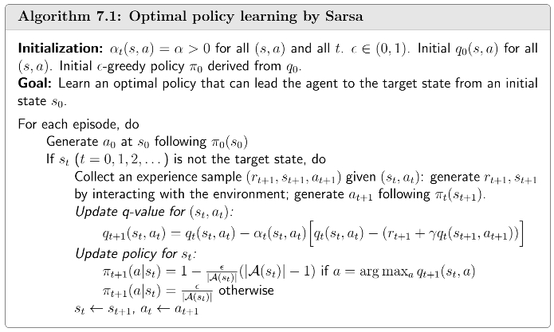
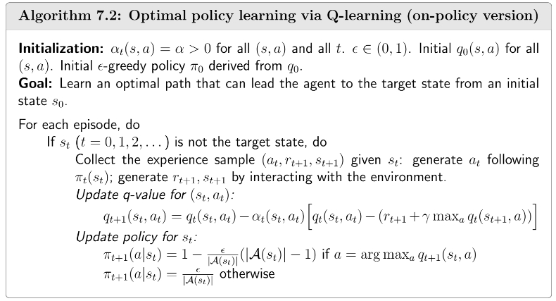
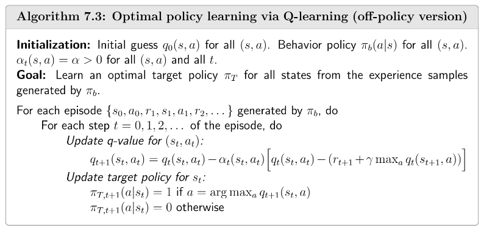

## TD Learning of State Values

### Algorithm Description

之前介绍的蒙特卡洛学习方法每次更新时需要完整的采样episode，本节介绍的时序差分方法(Temporal Difference Learning)不需要完整的episode，只需要利用当前状态和下一状态的信息，是一种增量式model-free的算法。

给定一个policy \(\pi\)，我们的目标是估计state value `$v_{\pi}(s), \forall s \in \mathcal{S}$`。根据policy `$\pi$`，我们得到一些采样数据`$(s_0,r_1,s_1,\cdots,s_t,r_{t+1},s_{t+1},\cdots)$`，TD算法估计state value的迭代公式为

`$$\begin{equation}\label{eq:1}\begin{aligned}
v_{t+1}(s_t)&=v_t(s_t)-\alpha_t(s_t)\left[v_t(s_t)-(r_{t+1}+\gamma v_t(s_{t+1}))\right], \\
v_{t+1}(s)&=v_t(s), \quad \forall s \neq s_t,
\end{aligned}\end{equation}$$`

其中，`$v_t(s_t)$`是`$v_{\pi}(s_t)$`的估计值，`$\alpha_t(s_t)$`是学习率。在时刻`$t$`，只有被访问的state `$s_t$`的state value被更新，其余未被访问到的state `$s \neq s_t$`的state value保持不变。

下面我们使用[Robbins-Monro算法](/blog/rl-1-basic-concepts/)来推导TD算法的迭代公式。

回顾[state value](/blog/rl-6-stochastic-approximation-and-stochastic-gradient-descent/)的定义：

`$$\begin{aligned}
v_{\pi}(s)&=\mathbb{E}[R_{t+1}+\gamma G_{t+1}|S_t=s] \\
&=\mathbb{E}[R_{t+1}+\gamma v_{\pi}(S_{t+1})|S_t=s], \quad \forall s \in \mathcal{S}.
\end{aligned}$$`

对于state `$s_t$`，定义

`$$g(v_{\pi}(s_t)) \overset{\triangle}{=}v_{\pi}(s_t)-\mathbb{E}[R_{t+1}+\gamma v_{\pi}(S_{t+1})|S_t=s_t].$$`

那么有`$g(v_{\pi}(s_t))=0$`，下面使用RM算法求解该Bellman方程。我们可以得到随机变量`$R_{t+1}$`和`$S_{t+1}$`的样本`$r_{t+1}$`和`$s_{t+1}$`，含有噪声的`$g(v_{\pi}(s_t))$`的观测值为

`$$\begin{aligned}
\tilde{g}(v_\pi(s_t)) &= v_\pi(s_t) - \left[r_{t+1} + \gamma v_\pi(s_{t+1})\right] \\
&=\underbrace{\left( v_\pi(s_t) - \mathbb{E}\big[R_{t+1} + \gamma v_\pi(S_{t+1}) \big| S_t = s_t \big] \right)}_{g(v_\pi(s_t))} \\
&+\underbrace{\left( \mathbb{E}\big[R_{t+1} + \gamma v_\pi(S_{t+1}) \big| S_t = s_t \big] - \left[ r_{t+1} + \gamma v_\pi(s_{t+1}) \right] \right)}_{\eta}.
\end{aligned}$$`

进而使用RM算法迭代公式求解：

`$$\begin{equation}\label{eq:2}\begin{aligned}
v_{t+1}(s_t) &= v_t(s_t) - \alpha_t(s_t) \tilde{g}(v_t(s_t)) \\
&= v_t(s_t) - \alpha_t(s_t) \left( v_t(s_t) - \left[ r_{t+1} + \gamma v_\pi(s_{t+1}) \right] \right),
\end{aligned}\end{equation}$$`

其中，`$v_t(s_t)$`是`$v_{\pi}(s_t)$`的估计值，`$\alpha_t(s_t)$`是学习率。

公式`$\eqref{eq:2}$`和TD算法的公式`$\eqref{eq:1}$`的不同点在于公式`$\eqref{eq:2}$`的右边包含`$v_{\pi}(s_{t+1})$`，而公式`$\eqref{eq:1}$`的右边是`$v_t(s_{t+1})$`。这是因为公式`$\eqref{eq:2}$`假设除了state `$s_t$`的其他state value已知，如果我们要估计所有的state value，那么需要将`$v_{\pi}(s_{t+1})$`替换为`$v_t(s_{t+1})$`。

### Convergence Analysis

根据RM算法框架，可以证明TD算法也是收敛的。

**TD算法收敛性定理：** 给定policy `$\pi$`，如果`$\sum_t \alpha_t(s)=\infty, \sum_t \alpha_t^2(s)<\infty(\forall s \in \mathcal{S})$`，那么`$\forall s \in \mathcal{S}$`，当`$t \rightarrow \infty$`时，`$v_t(s)$`几乎必然收敛到`$v_{\pi}(s)$`。

- `$\sum_t \alpha_t(s)=\infty$`表明每个状态都需要被访问无数次(或者足够多次)。

- `$\sum_t \alpha_t^2(s)<\infty$`表明学习率逐渐衰减，但实际情况常常设置为一个较小的数，以防止后面的样本失效。

### Algorithm Property

下面我们细致地分析TD算法的一些性质。首先，TD算法可以具体地写为如下形式：

`$$\begin{equation}\label{eq:3}
\underbrace{v_{t+1}(s_t)}_{\text{new estimate}} = 
\underbrace{v_t(s_t)}_{\text{current estimate}} - \alpha_t(s_t) [ \overbrace{v_t(s_t) - \underbrace{\left( r_{t+1} + \gamma v_t(s_{t+1}) \right)}_{\text{TD target } \bar{v}_t}}^{\text{TD error } \delta_t} ],
\end{equation}$$`

其中，`$\bar{v}_t=r_{t+1} + \gamma v_t(s_{t+1})$`叫做**TD target**，`$\delta_t=v_t(s_t)-\bar{v}_t=v_t(s_t)-(r_{t+1} + \gamma v_t(s_{t+1})$`叫做**TD error**，state value的新估计`$v_{t+1}(s_t)$`是当前估计`$v_t(s_t)$`和TD error的组合。

- 算法让`$v_t(s_t)$`朝着`$\bar{v}_t$`这个目标值去更新。公式`$\eqref{eq:3}$`两边同时减去`$\bar{v}_t$`：

  `$$\begin{aligned}
v_{t+1}(s_t) - \bar{v}_t &= v_t(s_t) - \bar{v}_t - \alpha_t(s_t)\left[v_t(s_t)-\bar{v}_t \right] \\
&= \left[1-\alpha_t(s_t)\right] \left[v_t(s_t)-\bar{v}_t \right].
\end{aligned}$$`

  两边取绝对值得：

  `$$|v_{t+1}(s_t)-\bar{v}_t|=|1-\alpha_t(s_t)||v_t(s_t)-\bar{v}_t|.$$`

  由于`$\alpha_t(s_t)$`是一个很小的正数，那么有：

  `$$0<1-\alpha_t(s_t)<1.$$`

  进而可得：

  `$$|v_{t+1}(s_t)-\bar{v}_t|<|v_t(s_t)-\bar{v}_t|$$`

  由此可知，每更新一次估计值`$v_t(s_t)$`与目标值`$\bar{v}_t$`的差距都会减小。
  
- TD error `$\delta_t$`反映了两个时间步`$t$`和`$t+1$`之间的差异，并且当state value估计准确时，TD error的期望为0，具体地，当`$v_t(s_t)=v_{\pi}(s_t)$`时，

  `$$\begin{aligned}
\mathbb{E}[\delta_t|S_t=s_t]&=\mathbb{E}\left[v_{\pi}(S_t)-(R_{t+1}+\gamma v_{\pi}(S_{t+1}))|S_t=s_t\right] \\
&=v_{\pi}(s_t)-\mathbb{E}\left[R_{t+1}+\gamma v_{\pi}(S_{t+1})|S_t=s_t\right] \\
&= 0.
\end{aligned}$$`

  因此，TD error不仅反映两个时间步之间的差异，还反映了state value估计值`$v_{t}(s_t)$`和真实值`$v_{\pi}(s_t)$`的差异。所以可以把TD error当作一个从当前样本`$(s_t,r_{t+1},s_{t+1})$`所获取的新的信息，用于我们对`$v_{t}(s_t)$`进行下一步更新以减少差异。

其次，只有给定policy，TD算法才能够估计state value。为了找到最优policy，仍然需要计算action value并进行policy improvement。

最后，既然TD算法和MC算法都是model-free的，它们有什么区别呢？两者的详细对比如下：

| TD Learning                          | MC Learning                           |
| -------------------------------------------|---------------------------------------|
| **Online:** 每得到一个样本就可以更新                  | **Offline:** 收集一整个episode才能更新     |
|适用于[**Continuing and episodic task**](/blog/rl-1-basic-concepts)        | 适用于**Episodic task**                       |
| **Bootstrapping:** 每次更新依赖于前一次的更新值               | **Non-bootstrapping:** 直接用采样结果估计                    |
| 随机变量较少(`$R_{t+1},S_{t+1},A_{t+1}$`)，估计**方差较低**                  | 随机变量较多(`$R_{t+1},R_{t+2},R_{t+3},\cdots$`)，估计**方差较多**         |
| **估计值有偏**，依赖于初始猜测，但最终能收敛             | **估计值无偏**，直接求期望                      |

## TD Learning of Action Values

### Sarsa

基础的TD算法只能估计state value，但由于该算法是model-free的，我们需要估计action value来进行policy evaluation和policy improvement。本节介绍的**Sarsa算法**则是直接估计action value。

给定一个policy `$\pi$`，我们的目标是估计action value `$q_{\pi}(s,a), \forall s \in \mathcal{S}, a \in \mathcal{A}(s)$`。根据给定的policy `$\pi$`，我们得到一些采样数据`$(s_0,a_0,r_1,s_1,a_1,\cdots,s_t,a_t,r_{t+1},s_{t+1},a_{t+1}\cdots)$`，Sarsa算法估计action value的迭代公式为

`$$\begin{aligned}
q_{t+1}(s_t,a_t)&=q_t(s_t,a_t)-\alpha_t(s_t,a_t)\left[q_t(s_t,a_t)-(r_{t+1}+\gamma q_t(s_{t+1},a_{t+1}))\right], \\
q_{t+1}(s,a)&=q_t(s,a), \quad \forall (s,a) \neq (s_t,a_t),
\end{aligned}$$`

其中，`$q_t(s_t,a_t)$`是`$q_{\pi}(s_t,a_t)$`的估计值，`$\alpha_t(s_t,a_t)$`是学习率。在时刻`$t$`，只有被访问的state-action pair `$(s_t,a_t)$`的action value被更新，其余未被访问到的state-action pair `$(s,a) \neq (s_t,a_t)$`的action value保持不变。

- 该算法叫做Sarsa是因为每一次迭代需要一个state-action-reward-state-action数据`$(s_t,a_t,r_{t+1},s_{t+1},a_{t+1})$`。

- Sarsa算法的形式与基础的TD算法是一样的，只是将`$v(s)$`替换成`$q(s,a)$`。

- 与基础的TD算法类似，Sarsa算法也是一个随机近似算法，用于求解以下关于action value的Bellman equation：

`$$q_{\pi}(s,a)=\mathbb{E}\left[R+\gamma q_{\pi}(S',A')|s,a\right], \quad \forall (s,a).$$`

- **Sarsa算法收敛性定理：** 给定policy `$\pi$`，如果`$\sum_t \alpha_t(s,a)=\infty, \sum_t \alpha_t^2(s,a)<\infty(\forall (s,a))$`，那么`$\forall (s,a)$`，当`$t \rightarrow \infty$`时，`$q_t(s,a)$`几乎必然收敛到`$q_{\pi}(s,a)$`。

强化学习算法的最终目的是找到最优policy，Sarsa算法可以估计action value以进行policy evaluation的过程，我们将其与policy improvement过程结合，得到Sarsa算法的伪代码如下；

Sarsa算法主要分为两步，第一步是根据`$(s_t,a_t,r_{t+1},s_{t+1},a_{t+1})$`估计action value，然后马上使用[`$\epsilon$`-greedy](/blog/rl-5-monte-carlo-learning)策略更新`$s_t$`的policy。也就是说，在进行policy improvement之前我们不需要计算精确的action value以进行充分的policy evaluation，而是估计一次action value就更新一次policy，这个思想就是在蒙特卡洛学习中提到的[generalize policy iteration](/blog/rl-5-monte-carlo-learning)。

### Expected Sarsa

Expected Sarsa是Sarsa的一种变体，它的迭代公式为

`$$\begin{aligned}
q_{t+1}(s_t,a_t)&=q_t(s_t,a_t)-\alpha_t(s_t,a_t)\left[q_t(s_t,a_t)-(r_{t+1}+\gamma \mathbb{E}[q_t(s_{t+1},A)])\right], \\
q_{t+1}(s,a)&=q_t(s,a), \quad \forall (s,a) \neq (s_t,a_t), \\
\end{aligned}$$`

其中，`$\mathbb{E}[q_t(s_{t+1},A)] = \sum_{a}\pi_t(a|s_{t+1})q_t(s_{t+1},a)=v_t(s_{t+1})$`是`$q_t(s_{t+1},a)$`在policy `$\pi_t$`下的期望。

- Expected Sarsa的TD target由Sarsa的`$r_{t+1}+\gamma q_t(s_{t+1},a_{t+1})$`变为`$r_{t+1}+\gamma \mathbb{E}[q_t(s_{t+1},A)]$`。

- 由于要计算期望，Expected Sarsa计算量比Sarsa更高，但是随机变量也减少一个(`$A_{t+1}$`)，方差更小。

- Expected Sarsa也是一个随机近似算法，用于求解以下关于action value的Bellman equation：

  `$$q_{\pi}(s,a)=\mathbb{E}\left[R_{t+1}+\gamma v_{\pi}(S_{t+1})|S_t=s,A_t=a\right], \quad \forall (s,a).$$`

### n-Step Sarsa

Sarsa算法的目标是求解如下方程：

`$$q_{\pi}(s,a)=\mathbb{E}\left[ G_t^{(1)}|S_t=s,A_t=a \right]=\mathbb{E}\left[ R_{t+1}+\gamma q_{\pi}(S_{t+1},A_{t+1})|S_t=s,A_t=a \right].$$`

MC learning的目标是求解如下方程：

`$$q_{\pi}(s,a)=\mathbb{E}\left[ G_t^{(\infty)}|S_t=s,A_t=a \right]=\mathbb{E}\left[ R_{t+1}+\gamma R_{t+2}+\gamma^2 R_{t+3}+\cdots|S_t=s,A_t=a \right].$$`

而n-step Sarsa算法是一个折中方案，目标是求解如下方程：

`$$q_{\pi}(s,a)=\mathbb{E}\left[ G_t^{(n)}|S_t=s,A_t=a \right]=\mathbb{E}\left[ R_{t+1}+\gamma R_{t+2}+\cdots+\gamma^n q_{\pi}(S_{t+n},A_{t+n})|S_t=s,A_t=a \right].$$`

n-step Sarsa算法的迭代公式为

`$$q_{t+1}(s_t,a_t)=q_t(s_t,a_t)-\alpha_t(s_t,a_t)\left[q_t(s_t,a_t)-(r_{t+1}+\gamma r_{t+2}+\cdots+\gamma q_t(s_{t+n},a_{t+n}))\right].$$`

n-step Sarsa算法有如下性质：

- n-step Sarsa需要的数据为`$(s_t,a_t,r_{t+1},s_{t+1},a_{t+1},\cdots,r_{t+n},s_{t+n},a_{t+n})$`，也就是说需要收集`$t$`步数据才能够更新action value。

- Sarsa和MC learning是n-step Sarsa的极端情况。当`$n=1$`时，n-step Sarsa变为Sarsa，当`$n=\infty$`时，n-step Sarsa变为MC learning。

- 当`$n$`很大时，n-step Sarsa的性能就接近MC learning，有着高方差和小偏差。当`$n$`很小时，n-step Sarsa的性能就与Sarsa相近，有着低方差和相对大偏差。

## TD Learning of Optimal Action Values: Q-Learning

### Q-Learning

Sarsa算法只能够估计给定的一个policy的action value，它必须再结合policy improvement才能够找到最优policy，而Q-learning则是直接估计最优action value，进而找到最优policy。

Q-learning算法的迭代公式为

`$$\begin{aligned}
q_{t+1}(s_t,a_t) &= q_t(s_t,a_t) - \alpha_t(s_t,a_t) \left[q_t(s_t,a_t)-[r_{t+1}+\gamma \max_{a \in \mathcal{A(s_{t+1})}}q_t(s_{t+1},a)]\right], \\
q_{t+1}(s,a)&=q_t(s,a), \quad \forall (s,a) \neq (s_t,a_t), \\
\end{aligned}$$`

其中，`$\max_{a \in \mathcal{A(s_{t+1})}}q_t(s_{t+1},a)$`是在state `$s_{t+1}$`时，最大的action value。Q-learning和Sarsa的主要区别在于TD target：

- Q-learning的TD target为`$r_{t+1}+\gamma \max_{a \in \mathcal{A(s_{t+1})}}q_t(s_{t+1},a)$`。
- Sarsa的TD target为`$r_{t+1}+\gamma q_t(s_{t+1},a)$`。

在数学上，Q-learning也是一个随机近似算法，用于求解以下关于action value的Bellman optimality equation ([证明过程](https://github.com/MathFoundationRL/Book-Mathematical-Foundation-of-Reinforcement-Learning/blob/main/3%20-%20Chapter%207%20Temporal-Difference%20Methods.pdf))：

`$$q(s,a)=\mathbb{E}\left[R_{t+1}+\gamma \max_{a \in \mathcal{A}(S_{t+1})} q(S_{t+1},a)|S_t=s,A_t=a\right], \quad \forall (s,a).$$`

### Off-Policy vs. On-Policy

强化学习中有两种策略形式：

- **Behavior policy:** 与环境交互产生样本数据。
- **Target policy:** 不断更新收敛到最优policy。

根据behavior policy和target policy的关系，强化学习算法可以分为两类：

- **On-policy:** behavior policy和target policy相同，也就是更新后的policy产生数据，再将数据用于更新该policy。
- **Off-policy:** behavior policy和target policy不同，也就是可以通过一个behavior policy (例如一个探索性较强的policy)产生数据，将该数据用于改进另一个target policy。

在之前章节学过的算法中，Sarsa和MC learning是on-policy算法，而Q-learning是off-policy算法，下面进行逐一分析。

- Sarsa的更新公式为
  
  `$$q_{t+1}(s_t,a_t)=q_t(s_t,a_t)-\alpha_t(s_t,a_t)\left[q_t(s_t,a_t)-(r_{t+1}+\gamma q_t(s_{t+1},a_{t+1}))\right].$$`
  
  Sarsa需要`$(s_t,a_t,r_{t+1},s_{t+1},a_{t+1})$`这些数据，若`$s_t$`和`$a_t$`是给定的，那么`$r_{t+1}$`和`$s_{t+1}$`也是确定的，与policy无关，而`$a_{t+1}$`则是由policy `$\pi_{t}(s_{t+1})$`产生。
  
- MC learning的更新公式为

  `$$q_{\pi_k}(s,a)=\mathbb{E}[R_{t+1}+\gamma R_{t+2}+\cdots|S_t=s,A_t=a].$$`
  
  episode数据是根据当前behavior policy `$\pi_k$`进行采样得到的。

- Q-learning的更新公式为

  `$$q_{t+1}(s_t,a_t) = q_t(s_t,a_t) - \alpha_t(s_t,a_t) \left[q_t(s_t,a_t)-[r_{t+1}+\gamma \max_{a \in \mathcal{A(s_{t+1})}}q_t(s_{t+1},a)]\right].$$`
  
  Q-learning需要`$(s_t,a_t,r_{t+1},s_{t+1})$`这些数据，若`$s_t$`和`$a_t$`是给定的，那么`$r_{t+1}$`和`$s_{t+1}$`也是确定的，与policy无关，而此时behavior policy可以是任意的。

### Q-learning Implementation

Q-learning是off-policy的，那么可以使用on-policy(设置behavior policy和target policy一样)和off-policy两种方式来实现它。

在on-policy版本中，由于behavior policy和target policy一样，因此policy improvement时采用`$\epsilon$`-greedy策略进行探索。在off-policy中，由于behavior policy独立，可以使用探索性较强的policy，因此policy improvement时直接采用贪心策略进行更新。

## A Unified Viewpoint

本章节的算法可以用一个统一的公式来描述：

`$$q_{t+1}(s_t,a_t) = q_t(s_t,a_t) - \alpha_t(s_t,a_t) \left[q_t(s_t,a_t)-\bar{q_t}\right],$$`

其中`$\bar{q_t}$`是TD target。

各个算法的TD target如下：

| 算法         | `$\bar{q}_t$` 形式                                                                 |
|--------------|-----------------------------------------------------------------------------------|
| Sarsa        | `$\bar{q}_t = r_{t+1} + \gamma q_t(s_{t+1}, a_{t+1})$`                             |
| n-Step Sarsa | `$\bar{q}_t = r_{t+1} + \gamma r_{t+2} + \cdots + \gamma^n q_t(s_{t+n}, a_{t+n})$` |
| Expected Sarsa | `$\bar{q}_t = r_{t+1} + \gamma \sum_a \pi_t(a \mid s_{t+1}) q_t(s_{t+1}, a)$`    |
| Q-Learning   | `$\bar{q}_t = r_{t+1} + \gamma \max_a q_t(s_{t+1}, a)$`                            |
| MC Learning  | `$\bar{q}_t = r_{t+1} + \gamma r_{t+2} + \cdots$`                                  |

各个算法可以看成求解Bellman equation或者Bellman optimality equation的随机近似算法：

| 算法         | 数学问题                                                                 |
|--------------|--------------------------------------------------------------------------|
| Sarsa        | BE : `$q_\pi(s, a) = \mathbb{E}[R_{t+1} + \gamma q_\pi(S_{t+1}, A_{t+1}) \mid S_t = s, A_t = a]$` |
| n-Step Sarsa | BE : `$q_\pi(s, a) = \mathbb{E}[R_{t+1} + \gamma R_{t+2} + \cdots + \gamma^n q_\pi(S_{t+n}, A_{t+n}) \mid S_t = s, A_t = a]$` |
| Expected Sarsa | BE : `$q_\pi(s, a) = \mathbb{E}[R_{t+1} + \gamma \mathbb{E}_{A_{t+1}}[q_\pi(S_{t+1}, A_{t+1})] \mid S_t = s, A_t = a]$` |
| Q-Learning   | BOE : `$q(s, a) = \mathbb{E}[R_{t+1} + \gamma \max_a q(S_{t+1}, a) \mid S_t = s, A_t = a]$` |
| MC Learning  | BE : `$q_\pi(s, a) = \mathbb{E}[R_{t+1} + \gamma R_{t+2} + \cdots \mid S_t = s, A_t = a]$` |

