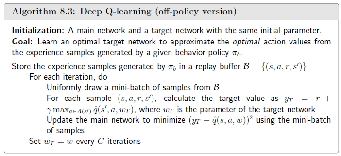

## Value Representation: From Table to Function

之前学习的算法，都是基于表格形式的，也就是将 state value 和 action value 记录在表格中。这种方法的优势是非常直观并且容易分析，劣势是当 state 非常多甚至是连续的时候存储这个表格就需要花费大量的内存，并且处理起来效率很低。

为了克服这个问题，可以引入一个函数来近似 state value。例如，有 \(n\) 个状态 \(s_1, \cdots, s_n\)，对应的 state value 分别是 \(v_{\pi}(s_1), \cdots, v_{\pi}(s_n)\)，如果 \(n\) 非常大，我们尝试用一个简单的曲线来拟合 state 和 state value 之间的关系：

$$\hat{v}(s, w) = as + b = \underbrace{[s, 1]}_{\phi^T(s)} \underbrace{\begin{bmatrix} a \\ b \end{bmatrix}}_{w} = \phi^T(s)w.$$

其中，\(w\) 是参数向量，\(\phi(s)\) 是状态特征向量。

- 基于表格的方法要存储 \(n\) 个 state value，而现在只需要存储 \(a\) 和 \(b\) 两个参数。
- 当我们需要 state value 时，只要计算 \(\phi^T(s)w\)即可。
- 该方法提升了存储效率但降低了精度。

我们也可以用更高阶的曲线进行拟合：

$$\hat{v}(s, w) = as^2 + bs + c = \underbrace{[s^2, s, 1]}_{\phi^T(s)} \underbrace{\begin{bmatrix} a \\ b \\ c \end{bmatrix}}_{w} = \phi^T(s)w.$$

这里，\(\hat{v}(s, w)\) 对于 \(s\) 是非线性的，对于 \(w\) 是线性的。

当我们想更新 state value 时，基于表格的方法可以直接在表格对应位置修改，而值函数近似的方法则需要更新参数向量 \(w\)，间接地更改 state value。

基于上述性质，值函数近似的方法的泛化能力也更好。具体来说，在表格方法中，当更新某个 state 的 state value 时，其他 state 对应的 state value 就没有更新。而值函数近似方法中，由于参数向量 \(w\) 变了，也会影响其他 state 的 state value，这有助于更新附近 state 的 state value。

## Algorithm for State Value Estimation

### Objective Function

令 \(v_{\pi}(s)\) 和 \(\hat{v}(s, w)\) 分别为实际的 state value 和 估计的 state value，我们要找到最优的 \(w\) 使得 \(\hat{v}(s, w)\) 可以非常好地估计 \(v_{\pi}(s)\)，具体的目标函数为

$$J(w) = \mathbb{E}[(v_{\pi}(S) - \hat{v}(S, w))^2].$$

通过最小化目标函数 \(J(w)\)，找到最优参数 \(w\)。目标函数中需要求期望，这依赖于随机变量 \(S\)的概率分布，一般有以下两种处理方式：

- **均匀分布**：将所有的 state 视为同等重要，求期望时每个 state 的概率为 \(\frac{1}{|\mathcal{S}|}\)，目标函数可以写为

  $$J(w) = \mathbb{E}[(v_{\pi}(S) - \hat{v}(S, w))^2] = \frac{1}{|S|}\sum_{s \in S} (v_{\pi}(s) - \hat{v}(s, w))^2.$$

  通常有些 state 很少被访问到，那么它们的重要程度应当比较低，因此该方法不太合理。

- **平稳分布**：该分布描述了马尔可夫过程的一个长期行为，agent 与环境进行长时间的交互，最终达到的一个稳定分布 \(\{d_{\pi}(s)\}_{s \in \mathcal{S}}\)。目标函数为

  $$J(w) = \mathbb{E}[(v_{\pi}(S) - \hat{v}(S, w))^2] = \sum_{s \in S} d_{\pi}(s)(v_{\pi}(s) - \hat{v}(s, w))^2.$$
  
  被访问次数越多的 state，对应的概率 \(d_{\pi}\) 越大，也就更加重要，这也是符合逻辑的。

### Optimization Algorithms

使用梯度下降法最小化目标函数 \(w_{k+1} = w_k - \alpha_k \nabla_w J(w_k)\)。

首先计算 \(J(w)\) 的梯度：

$$\begin{align*}
\nabla_w J(w) &= \nabla_w\mathbb{E}[(v_{\pi}(S) - \hat{v}(S, w))^2] \\
&= \mathbb{E}[\nabla_w(v_{\pi}(S) - \hat{v}(S, w))^2] \\
&= 2\mathbb{E}[(v_{\pi}(S) - \hat{v}(S, w))(-\nabla_w\hat{v}(S, w))] \\
&= -2\mathbb{E}[(v_{\pi}(S) - \hat{v}(S, w))\nabla_w\hat{v}(S, w)].
\end{align*}$$

为了避免计算梯度中的期望，可以使用随机梯度下降：

$$w_{t+1} = w_t + \alpha_t (v_{\pi}(s_t) - \hat{v}(s_t, w_t)) \nabla_w \hat{v}(s_t, w_t).$$

但是改迭代公式中需要真实的 state value \(v_{\pi}\)，而这是未知的。我们有以下两种方法来估计 \(v_{\pi}(s_t)\)：

- **MC learning**：假设我们有一个 episode \((s_0, r_1, s_1, r_2, \cdots)\)，使用 discounted return \(g_t\) 来估计 \(v_{\pi}(s_t)\)：

  $$w_{t+1} = w_t + \alpha_t (g_t - \hat{v}(s_t, w_t)) \nabla_w \hat{v}(s_t, w_t).$$

- **TD learning**：使用 TD target 来估计 \(v_{\pi}(s_t)\)：
  
  $$w_{t+1} = w_t + \alpha_t (r_{t+1} + \gamma \hat{v}(s_{t+1}, w_t) - \hat{v}(s_t, w_t)) \nabla_w \hat{v}(s_t, w_t).$$

### Selection of Function Approximators

得到迭代公式之后，还有一个重要的问题是，如何选择 \(\hat{v}(s, w)\) 的函数形式？这里介绍两种方法：

- **线性模型**：\(\hat{v}(s, w) = \phi^T(s) w\)，\(\phi^T(s)\) 是状态特征向量。这种方法的迭代公式为

  $$w_{t+1} = w_t + \alpha_t [r_{t+1} + \gamma \phi^T(s_{t+1}) w_t - \phi^T(s_t) w_t] \phi(s_t).$$

- **非线性模型**：选择神经网络作为一个非线性函数，网络的参数为 \(w\)。

### Theoretical Analysis

前面我们使用的目标函数是真实误差：

$$J_E(w) = \mathbb{E}[(v_{\pi}(S) - \hat{v}(S, w))^2] = \|\hat{v}(w) - v_{\pi}\|^2_D,$$

其中，\(\|x\|_D^2 = x^TDx = \|D^{1/2}x\|_2^2\)，\(D\) 是 \(\{d_{\pi}(s)\}_{s \in \mathcal{S}}\) 构成的对角矩阵。

改目标函数非常简单，但它的计算依赖于真实的 state value \(v_{\pi}\)，这是未知的，而我们之前 TD learning 对 \(v_{\pi}\) 进行了估计，因此 TD learning 实际上并不是最小化这个目标函数。

现在我们介绍另外一个贝尔曼误差（Bellman Error）：

$$J_{BE}(w) = \|\hat{v}(w) - (r_{\pi} + \gamma P_{\pi} \hat{v}(w))\|^2_D \triangleq \|\hat{v}(w) - T_{\pi}(\hat{v}(w))\|^2_D,$$

其中，\(T_{\pi}(x) \triangleq r_{\pi} + \gamma P_{\pi} x\)。我们希望 \(\hat{v}\) 能够近似 \(v_{\pi}\)，而 \(v_{\pi}\) 满足 Bellman equation，因此 \(\hat{v}\) 也应该满足 Bellman equation，这是该误差的设计思想。

由于所选择的函数近似能力有限，一般不能完全逼近真实函数，那么 \(J_{BE}(w)\) 就不会降到零。因此我们对 \(T_{\pi}(x)\) 做一次投影，得到投影贝尔曼误差（Projected Bellman Error），使得目标函数可以被最小化到零：

$$J_{PBE}(w) = \|\hat{v}(w) - MT_{\pi}(\hat{v}(w))\|^2_D,$$

其中，\(M\) 是投影矩阵。

TD earning 的目标函数实际上就是投影贝尔曼误差，[具体证明见课本](https://github.com/MathFoundationRL/Book-Mathematical-Foundation-of-Reinforcement-Learning/blob/main/3%20-%20Chapter%208%20Value%20Function%20Methods.pdf)。

## Sarsa and Q-Learning with Function Approximation

根据前几节，我们已经找到了 state value 的估计方法，但为了寻找最优 policy，我们需要估计 action value。

- **Sarsa**：将 TD learning 中的 \(\hat{v}\) 替换为 \(\hat{q}\) 就得到了值函数近似的 Sarsa 算法：

  $$w_{t+1} = w_t + \alpha_t \left[ r_{t+1} + \gamma \hat{q}(s_{t+1}, a_{t+1}, w_t) - \hat{q}(s_t, a_t, w_t) \right] \nabla_w \hat{q}(s_t, a_t, w_t).$$

- **Q-learning**：将 Sarsa 算法中的 \(\hat{q}(s_{t+1}, a_{t+1}, w_t)\) 替换为 \(\max_{a \in \mathcal{A}(s_{t+1})} \hat{q}(s_{t+1}, a, w_t)\) 就得到了值函数近似的 Q-learning 算法：

  $$w_{t+1} = w_t + \alpha_t \left[ r_{t+1} + \gamma \max_{a \in \mathcal{A}(s_{t+1})} \hat{q}(s_{t+1}, a, w_t) - \hat{q}(s_t, a_t, w_t) \right] \nabla_w \hat{q}(s_t, a_t, w_t).$$

上述算法完成了 policy evaluation 的步骤，只需要将其和 policy improvement（如 \(\epsilon\)-greedy等）相结合，即可找到最优 policy。具体地，与之前表格形式不同，值函数近似的算法的 policy evaluation 更新的是参数 \(w\)，我们还需要将 state 代入 \(\hat{q}\) 计算 action value，进而选择最优 action 。

## Deep Q-Learning

Deep Q-learning（或 Deep Q-Network，DQN）是一种将神经网络和 Q-learning 相结合的算法，它的目标函数为

$$J(w) = \mathbb{E} \left[ \left( R + \gamma \max_{a \in \mathcal{A}(S')} \hat{q}(S', a, w) - \hat{q}(S, A, w) \right)^2 \right],$$

该目标函数可以看作是贝尔曼最优误差（Bellman Optimality Error）的平方，因为

$$q(s,a) = \mathbb{E} \left[ R_{t+1} + \gamma \max_{a \in \mathcal{A}(S_{t+1})} q(S_{t+1}, a) \mid S_t = s, A_t = a \right], \quad \forall s, a$$

是 Bellman optimality equation。因此当 \(\hat{q}(S, A, w)\) 可以精确近似最优 action value 时，\(R + \gamma \max_{a \in \mathcal{A}(S')} \hat{q}(S', a, w) - \hat{q}(S, A, w)\) 在期望意义下应等于零。

有了目标函数后，我们就可以使用梯度下降法来求解。但是，目标函数中的 \(\hat{q}(S, A, w)\) 和 \(y \triangleq R + \gamma \max_{a \in \mathcal{A}(S')} \hat{q}(S', a, w)\) 都含有参数 \(w\)，第一项的梯度很容易求，但第二项的梯度就难以直接求出来。

为了解决这个问题，DQN 在优化过程中先将 \(y\) 视为一个常量，那么 \(J(w)\) 的梯度就可以直接计算。具体而言，引入了两个网络：

- 主网络： \(\hat{q}(s, a, w)\)，持续更新，每一步都计算梯度进行梯度下降。

- 目标网络：\(\hat{q}(s, a, w_T)\)，延迟更新，每隔一定的步数，将主网络更新的参数 \(w\) 赋值给目标网络的参数 \(w_T\)。

此时目标函数变为

$$J = \mathbb{E} \left[ \left( R + \gamma \max_{a \in \mathcal{A}(S')} \hat{q}(S', a, w_T) - \hat{q}(S, A, w) \right)^2 \right].$$

为了使用两个网络来最小化目标函数，下面是具体实现过程中需要注意的技巧：

- 将 \(w\) 和 \(w_T\) 做相同初始化。在每一次迭代更新时，我们需要从 replay buffer（稍后介绍）中采集一批样本 \(\{(s, a, r, s')\}\)。输入为 \(s\) 和 \(a\)，主网络输出为 action value 的估计值 \(y = \hat{q}(s, a, w)\)，目标网络输出为 \(y_T \triangleq r + \gamma \max_{a \in \mathcal{A}(s')} \hat{q}(s', a, w_T)\)。主网络基于 TD error \(\sum (y - y_T)^2\) 利用梯度下降法进行更新。

- 当我们收集了一些样本后，我们并不是直接按照收集的顺序进行使用，而是先将它们存储在 replay buffer。在每一次更新主网络时，我们按照均匀分布从 replay buffer 中选取一批样本进行更新计算（这称为 Experience Replay），这种采样可以去除样本采集时的时序相关性。

  为什么要使用 experience replay？为什么采样要服从均匀分布？由于目标函数是是一个期望，那就必须要知道 \(S, A\) 服从的分布，在没有明确的先验知识，通常假设 \(S, A\) 服从均匀分布，也就是每一个 state-action pair 是同等重要的。

Deep Q-learning 的具体求解步骤如下图：

