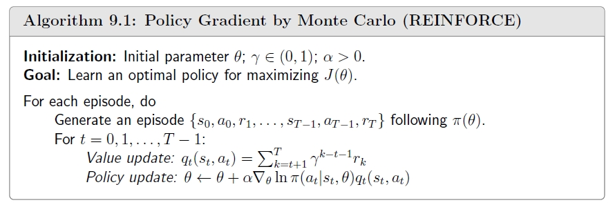

## Basic Idea of Policy Gradient

在之前的算法中，policy 也是表格形式的，类似于[值函数近似](/blog/rl-8-value-function-approximation/)，引入一个函数 \(\pi(a|s,\theta)\) 来近似 policy。这个函数通常是一个神经网络，参数是 \(\theta\)，输入是 state \(s\)，输出是采取各个 action 的概率。当 state space 很大的时候，该方法可以提升存储效率和泛化能力。

策略梯度（Policy Gradient）的思想主要分为两点：

- 定义一个合适的目标函数（反映 policy 的好坏）\(J(\theta)\)。

- 使用梯度上升法求解最优 policy。

## Metrics to Define Optimal Policy

一般有以下两种目标函数：

- **Average State Value：**

  $$\bar{v}_{\pi} = \mathbb{E}_{S \sim d} [v_{\pi}(S)] = \sum_{s \in \mathcal{S}} d(s) v_{\pi}(s) = d^{\top} v_{\pi},$$
  
  其中，\(d(s)\) 是 state \(s\) 的权重，满足 \(\sum_{s \in \mathcal{S}} d(s) = 1\)。
  
  分布 \(d\) 有以下两种形式：
  
  1. 与 policy 无关，记为 \(d_0\)，对应的 \(\bar{v}_{\pi}\) 记为 \(\bar{v}_{\pi}^0\)。由于分布 \(d_0\) 与 policy 无关，那么在计算梯度 \(\nabla \bar{v}_{\pi}^0\) 时就不用考虑分布 \(d_0\)，容易计算。一种最常用的方法就是认为所有的 state 同等重要，即 \(d_0(s) = \frac{1}{|\mathcal{S}|}\)。
  
  2. 与 policy 相关。一个常用的分布是上一节[值函数近似](/blog/rl-8-value-function-approximation/)中提到的平稳分布 \(d_{\pi}(s)\)，访问次数多的 state 对应的权重越大。
  
- **Average Reward：**

  $$\bar{r}_{\pi} \triangleq \mathbb{E}_{S \sim d_{\pi}} [r_{\pi}(S)] = \sum_{s \in S} d_{\pi}(s) r_{\pi}(s),$$
  
  其中，\(d_{\pi}\)是平稳分布，依赖于 policy \(\pi\)。\(r_{\pi}(s) \triangleq \sum_{a \in \mathcal{A}(s)} \pi(a|s) r(s, a)\) 是 immediate rewards 的均值，\(r(s, a) = \mathbb{E}[R|s, a] = \sum_{r \in R(s, a)} r p(r|s, a)\)。
  
  该目标函数还有另一种等价形式：
  $$\begin{align*}
  &\lim_{n \to \infty} \frac{1}{n} \mathbb{E} [R_{t+1} + R_{t+2} + \cdots + R_{t+n} | S_t = s_0] \\
= &\lim_{n \to \infty} \frac{1}{n} \mathbb{E} \left[ \sum_{k=1}^{n} R_{t+k} | S_t = s_0 \right],
\end{align*}$$

  其中，\(\{(R_{t+1}, R_{t+2}, \cdots)\}\) 是 agent 基于一个给定的 policy，从起点 \(s_0\) 出发生成的 trajectory 的每一步的 reward。由于考虑 \(n \rightarrow \infty\)，起点 \(s_0\) 就没有意义，因此有
  
  $$\bar{r}_{\pi} = \lim_{n \to \infty} \frac{1}{n} \mathbb{E} \left[ \sum_{k=1}^{n} R_{t+k} \right].$$
  
  两者等价的具体证明见[课本](https://github.com/MathFoundationRL/Book-Mathematical-Foundation-of-Reinforcement-Learning/blob/main/3%20-%20Chapter%209%20Policy%20Gradient%20Methods.pdf)。
  
关于上述两种目标函数的 remark 如下：

- 它们都是关于 policy \(\pi\) 的函数，进而是关于参数 \(\theta\) 的函数，因此我们的目标是找到能够最大化目标函数的 \(\theta\)。

- 直观上 \(\bar{r}_{\pi}\) 更加短视因为它只考虑 immediate rewards，而 \(\bar{v}_{\pi}\) 考虑了整体的 reward。但[可以证明](https://github.com/MathFoundationRL/Book-Mathematical-Foundation-of-Reinforcement-Learning/blob/main/3%20-%20Chapter%209%20Policy%20Gradient%20Methods.pdf)，当 \(\gamma < 1\) 时，\(\bar{r}_{\pi} = (1 - \gamma) \bar{v}_{\pi}\)。因此最大化其中一个目标时，另一个目标也会被最大化。
  
## Gradients of Metrics

有了目标函数后，我们需要目标函数 \(J(\theta)\) 对参数 \(\theta\) 的梯度，这里给出一个统一表达式：

$$\nabla_{\theta} J(\theta) = \sum_{s \in \mathcal{S}} \eta(s) \sum_{a \in \mathcal{A}} \nabla_{\theta} \pi(a | s, \theta) q_{\pi}(s, a),$$
  
其中：

- \(J(\theta)\) 可以是 \(\bar{v}_{\pi}, \bar{r}_{\pi}\) 或 \(\bar{v}_{\pi}^0\)。

- “\(=\)”可以是严格等于 \(=\)、近似 \(\simeq\) 或者成比例 \(\propto\)，却决于所使用的 \(J(\theta)\)。

- \(\eta\) 是一个分布，也取决于 \(J(\theta)\)。
  
具体地，我们有

$$\begin{align*}
\nabla_{\theta} \bar{r}_{\pi} &\simeq \sum_{s} d_{\pi}(s) \sum_{a} \nabla_{\theta} \pi(a | s, \theta) q_{\pi}(s, a), \\
\nabla_{\theta} \bar{v}_{\pi} &= \frac{1}{1 - \gamma} \nabla_{\theta} \bar{r}_{\pi}, \\
\nabla_{\theta} \bar{v}^{0}_{\pi} &= \sum_{s \in \mathcal{S}} \rho_{\pi}(s) \sum_{a \in \mathcal{A}} \nabla_{\theta} \pi(a | s, \theta) q_{\pi}(s, a).
\end{align*}$$
  
\(J(\theta)\) 可以写成期望的形式：

$$\begin{align*}
\nabla_{\theta} J(\theta) &= \sum_{s \in \mathcal{S}} \eta(s) \sum_{a \in \mathcal{A}} \textcolor{blue}{\nabla_{\theta} \pi(a | s, \theta)} q_{\pi}(s, a) \\
&= \sum_{s \in \mathcal{S}} \eta(s) \sum_{a \in \mathcal{A}} \textcolor{blue}{\pi(a | s, \theta) \nabla_{\theta} \ln \pi(a | s, \theta)} q_{\pi}(s, a) \\
&= \mathbb{E}_{\textcolor{blue}{S \sim \eta}} \left[ \sum_{a \in \mathcal{A}} \pi(a | S, \theta) \nabla_{\theta} \ln \pi(A | S; \theta) q_{\pi}(S, a) \right] \\
&= \mathbb{E}_{S \sim \eta, \textcolor{blue}{A \sim \pi}} \left[ \nabla_{\theta} \ln \pi(A | S, \theta) q_{\pi}(S, A) \right] \\
&= \mathbb{E} \left[ \nabla_{\theta} \ln \pi(A | S, \theta) q_{\pi}(S, A) \right]
\end{align*}.$$
  
当 \(J(\theta)\) 写成期望形式后，就可以使用样本数据对 \(J(\theta)\) 的梯度进行估计，进而使用随机梯度上升法来优化目标：

$$\nabla_{\theta}J(\theta) \approx \nabla_{\theta} \ln \pi(a | s, \theta) q_{\pi}(s, a).$$
  
由于我们需要计算 \(\ln \pi(a | s, \theta)\)，必须确保 \(\pi(a | s, \theta) > 0, \forall s, a, \theta\)。因此可以引入 softmax 函数，将神经网络的输出归一化到区间 \((0, 1)\)，具体公式如下：

$$\pi(a | s, \theta) = \frac{e^{h(s, a, \theta)}}{\sum_{a' \in \mathcal{A}} e^{h(s, a', \theta)}},$$

其中，\(h(s, a, \theta)\) 是一个神经网络，输入一个 state \(s\)，输出是一个可以反映其可能出现的各个 action \(a\) 概率的值。
  
## REINFORCE Algorithm

根据上一小节，可以使用随机梯度上升法进行参数更新：

$$\theta_{t+1} = \theta_t + \alpha \nabla_\theta \ln \pi(a_t | s_t, \theta_t) q_\pi(s_t, a_t).$$

其中 \(q_\pi(s_t, a_t)\) 是未知的，需要进行估计，REINFORCE 算法使用 [MC learning](/blog/rl-5-monte-carlo-learning) 估计：

$$\theta_{t+1} = \theta_t + \alpha \nabla_\theta \ln \pi(a_t | s_t, \theta_t) q_t(s_t, a_t).$$

我们使用一个随机梯度来近似真实梯度，有 \(S\) 和 \(A\) 两个随机变量，我们需要对 \((s, a)\) 进行采样。\(S \sim d_{\pi}\)，但实际上平稳分布 \(d_{\pi}\) 比较难获取，因此实际应用一般不考虑这一点。考虑到\( A \sim \pi(A|S, \theta)\)，我们使用 \(\pi(\theta_t)\) 分布来获取 \(a_t\)。因此，策略梯度实际上是 on-policy 算法，其 behavior policy 和 target policy 相同。

下面我们来探讨算法的解释性。先对参数更新公式进行改写：

$$\begin{align*}
\theta_{t+1} &= \theta_t + \alpha \nabla_\theta \ln \pi(a_t | s_t, \theta_t) q_t(s_t, a_t) \\
&= \theta_t + \alpha \underbrace{\left(\frac{q_t(s_t, a_t)}{\pi(a_t|s_t, \theta_t)}\right)}_{\beta_t} \nabla_\theta \pi(a_t | s_t, \theta_t) \\
&= \theta_t + \alpha \beta_t \nabla_\theta \pi(a_t | s_t, \theta_t) 
\end{align*}$$

根据梯度下降和梯度上升的原理，如果 \(\beta > 0\) 且 \(\alpha \beta_t\) 足够小，那么 \(\pi(a_t | s_t, \theta_{t + 1}) > \pi(a_t | s_t, \theta_t)\)，也就是提高选择 \((s_t, a_t)\) 的概率；如果 \(\beta < 0\) 且 \(\alpha \beta_t\) 足够小，那么 \(\pi(a_t | s_t, \theta_{t + 1}) < \pi(a_t | s_t, \theta_t)\)，也就是降低选择 \((s_t, a_t)\) 的概率。

事实上，\(\beta_t\) 是一个可以平衡 exploration 和 exploitation 的参数：

- \(\beta_t\) 与 \(q_t(s_t, a_t)\) 成正比，\(q_t(s_t, a_t)\) 越大，则 \(\beta_t\) 越大，\(\pi(a_t | s_t, \theta_{t + 1})\) 就越大，也就是新的 policy 会提高 action value 大的 action 的选择概率。

- \(\beta_t\) 与 \(\pi(a_t|s_t, \theta_t)\) 成反比，\(\pi(a_t|s_t, \theta_t)\) 越小，则 \(\beta_t\) 越大，\(\pi(a_t | s_t, \theta_{t + 1})\) 就越大，也就是新的 policy 会提高之前概率较小的 action 的选择概率。

REINFORCE 算法的伪代码如下：

  
  