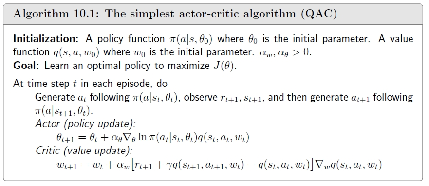
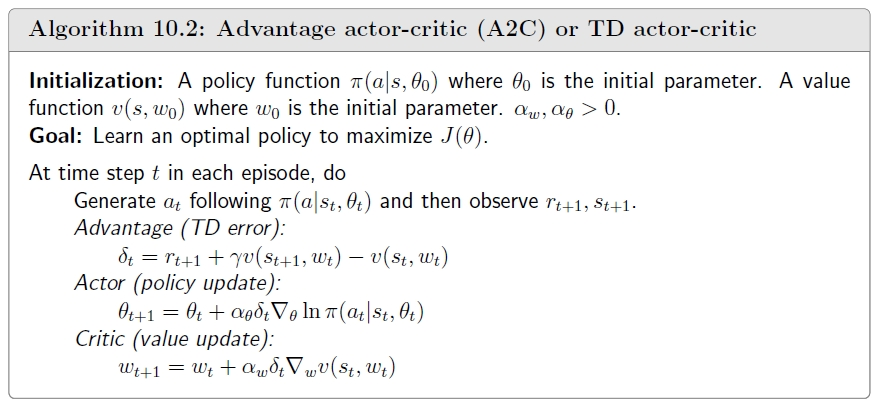
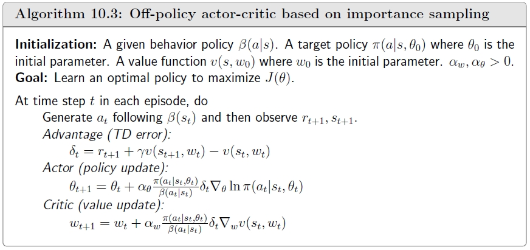
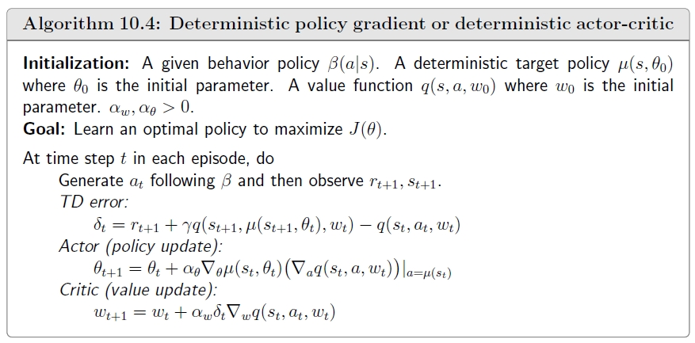

## Introduction

Actor-Critic 方法将值函数近似和策略梯度相结合的方法，它由两个部分组成：

- Actor：负责 policy update。

- Critic：负责 policy evaluation。

这两个部分相互合作，Actor 采取 action 与环境进行交互，Critic 评估 Actor 的表现，指导 Actor 的下一个 action。

## Q Actor-Critic（QAC）

在策略梯度算法中，我们使用随机梯度上升最大化目标函数 \(J(\theta)\)：

$$\theta_{t+1} = \theta_t + \alpha \nabla_\theta \ln \pi(a_t | s_t, \theta_t) q_t(s_t, a_t).$$

该随机梯度上升公式就是 Actor，负责 policy update；估计 \(q_t(s_t, a_t)\) 的算法就是 Critic，负责 policy evaluation。

上一节课介绍的 REINFORCE 算法使用 MC learning 来估计 \(q_t(s_t, a_t)\)，本节课的 Actor-Critic 方法则使用 [TD 算法](/blog/rl-7-TD-learning/)来估计 \(q_t(s_t, a_t)\)。

QAC 算法是直接使用 [Sarsa](/blog/rl-7-TD-learning/) 算法估计 \(q_t(s_t, a_t)\)，其伪代码如下：

- QAC 算法是 on-policy 的，每次都是用生成的新 policy 去采样生成数据。

- 属于随机性 policy，因为值函数近似使用了 softmax，\(\pi(a|s, \theta) > 0\)，因此不需要使用 \(\epsilon\)-greedy 的策略。

## Advantage Actor-Critic（A2C）

Policy gradient 有一个重要的性质，在目标函数中添加一个偏置项并不会改变梯度：

$$\begin{align*}
\nabla_{\theta} J(\theta) &= \mathbb{E}_{S \sim \eta, A \sim \pi} \left[ \nabla_{\theta} \ln \pi(A|S, \theta_t) q_{\pi}(S, A) \right] \\
&= \mathbb{E}_{S \sim \eta, A \sim \pi} \left[ \nabla_{\theta} \ln \pi(A|S, \theta_t) (q_{\pi}(S, A) - \textcolor{blue}{b(S)}) \right].
\end{align*}$$

为什么引入偏置项不改变梯度？具体的推导如下：

$$\begin{align*}
\mathbb{E}_{S \sim \eta, A \sim \pi} \left[ \nabla_{\theta} \ln \pi(A|S, \theta_t) b(S) \right] &= \sum_{s \in \mathcal{S}} \eta(s) \sum_{a \in \mathcal{A}} \pi(a|s, \theta_t) \nabla_{\theta} \ln \pi(a|s, \theta_t) b(s) \\
&= \sum_{s \in \mathcal{S}} \eta(s) \sum_{a \in \mathcal{A}} \pi(a|s, \theta_t) \frac{\nabla_\theta \pi(a|s, \theta_t)}{\pi(a|s, \theta_t)} b(s) \\
&= \sum_{s \in \mathcal{S}} \eta(s) \sum_{a \in \mathcal{A}} \nabla_{\theta} \pi(a|s, \theta_t) b(s) \\
&= \sum_{s \in \mathcal{S}} \eta(s) b(s) \sum_{a \in \mathcal{A}} \nabla_{\theta} \pi(a|s, \theta_t) \\
&= \sum_{s \in \mathcal{S}} \eta(s) b(s) \nabla_{\theta} \sum_{a \in \mathcal{A}} \pi(a|s, \theta_t) \\
&= \sum_{s \in \mathcal{S}} \eta(s) b(s) \nabla_{\theta} 1 = 0
\end{align*}$$

为什么引入偏置量是有用的？对于

$$X(S, A) \triangleq \nabla_{\theta} \ln \pi(A|S, \theta_t) [q_{\pi}(S, A) - b(S)],$$

\(\nabla_\theta J(\theta) = \mathbb{E} [X]\) 关于偏置项 \(b(S)\) 是不变的，但 \(\text{var}(X)\) 关于 \(b(S)\) 是变化的。具体地，\(\text{tr} [\text{var}(X)] = \mathbb{E}[X^T X] - \bar{x}^T \bar{x}\) 的第二项与 \(b(S)\) 无关，但

$$\begin{align*}
\mathbb{E}[X^T X] &= \mathbb{E} \left[ (\nabla_\theta \ln \pi)^T (\nabla_\theta \ln \pi) (q_\pi(S,A) - b(S))^2 \right] \\
&= \mathbb{E} \left[ \|\nabla_\theta \ln \pi\|^2 (q_\pi(S,A) - b(S))^2 \right]
\end{align*}$$

与 \(b(S)\) 是密切相关的。我们的目标是找到一个最优的 \(b(S)\) 能够最小化 \(\text{var}(X)\)，因为 \(\text{var}(X)\) 越小，那么当我们使用一个随机样本近似 \(\mathbb{E}[X]\) 时偏差就会越小。事实上，在 REINFORCE 算法和 QAC 算法中，可以看作是 \(b = 0\)，但这并不是一个好的偏置项。

[可以证明](https://github.com/MathFoundationRL/Book-Mathematical-Foundation-of-Reinforcement-Learning/blob/main/3%20-%20Chapter%2010%20Actor-Critic%20Methods.pdf)，最优的偏置项 \(b(S)\) 为

$$b^*(s) = \frac{\mathbb{E}_{A \sim \pi} \left[ \textcolor{blue}{\|\nabla_\theta \ln \pi(A|s, \theta_t)\|^2} \textcolor{red}{q_\pi(s, A)} \right]}{\mathbb{E}_{A \sim \pi} \left[ \textcolor{blue}{\|\nabla_\theta \ln \pi(A|s, \theta_t)\|^2} \right]}, \quad \forall s \in \mathcal{S}.$$

虽然这个偏置项能使得方差最小，但是计算比较复杂，可以将 \(\|\nabla_\theta \ln \pi(A|s, \theta_t)\|^2\) 去掉，直接使用

$$b(s) = \mathbb{E}_{A \sim \pi} [q_{\pi}(s, A)] = v_{\pi} (s).$$

此时梯度上升的迭代公式为

$$\begin{align*}
\theta_{t+1} &= \theta_t + \alpha \mathbb{E} \Big[ \nabla_\theta \ln \pi(A|S, \theta_t) \big[ \textcolor{blue}{q_\pi(S, A) - v_\pi(S)} \big] \Big] \\
&\triangleq \theta_t + \alpha \mathbb{E} \Big[ \nabla_\theta \ln \pi(A|S, \theta_t) \textcolor{blue}{\delta_\pi(S, A)} \Big].
\end{align*}$$

其中，\(\delta_\pi(S, A) \triangleq q_\pi(S, A) - v_\pi(S)\) 称为优势函数。\(v_\pi(S)\) 表示 \(q_\pi\) 在某一个 state 下的平均值，若某一个 \(q_\pi(S, A)\) 大于这个平均值，就说明这个 action 更好，更具有优势。

进而随机梯度上升的迭代公式为

$$\begin{align*}
\theta_{t+1} &= \theta_t + \alpha \nabla_\theta \ln \pi(a_t|s_t, \theta_t) \big[ q_t(s_t, a_t) - v_t(s_t) \big] \\
&= \theta_t + \alpha \nabla_\theta \ln \pi(a_t|s_t, \theta_t) \delta_t(s_t, a_t) \\
&= \theta_t + \alpha \frac{\nabla_{\theta} \pi(a_t|s_t, \theta_t)}{\pi(a_t|s_t, \theta_t)} \delta_t(s_t, a_t) \\
&= \theta_t + \alpha \underbrace{\left(\frac{\delta_t(s_t,a_t)}{\pi(a_t|s_t,\theta_t)}\right)}_{\textrm{step size}} \nabla_\theta \pi(a_t|s_t,\theta_t)
\end{align*}$$

步长由原来的绝对价值 \(q_t(s_t, a_t)\) 转变为相对价值 \(\delta_t(s_t, a_t)\)，与上一节类似，步长用于平衡 exploration 和 exploitation。\(\delta_t(s_t, a_t)\) 越大，\(\pi(a_t|s_t, \theta_{t+1})\) 就越大，新 policy 就会分配更大的选择概率给更优的动作，并且由于关注的是相对价值，可以防止出现 \(q_t(s_t, a_t)\) 绝对值很大但实际上没有相对优势的情况。

在实际算法求解时，常常将优势函数进一步近似：

$$\begin{align*}
\delta_t(s_t, a_t) &= q_t(s_t, a_t) - v_t(s_t) \\
&= r_{t+1} + \gamma v_t(s_{t+1}) - v_t(s_t).
\end{align*}$$

这个近似是合理的，它与原来的优势函数在期望意义上是相等的：

$$\mathbb{E}\left[q_{\pi}(S, A) - v_\pi(S) | S = s_t, A = a_t\right] = \mathbb{E}\left[R + \gamma v_\pi(S') - v_\pi(S) | S = s_t, A = a_t\right].$$

通过这个近似，我们就只需要一个神经网络去估计 \(v_{\pi}(s)\)，而不需要使用两个神经网络去分别估计 \(q_{\pi}(s, a)\) 和 \(v_{\pi}(s)\)。

最终 A2C 的伪代码如下：

## Off-Policy Actor-Critic

### Importance Sampling

考虑一个随机变量 \(X \in \mathcal{X} = \{+1, -1\}\)，它的概率分布 \(p_0\) 为

$$p_0(X = +1) = 0.5, \quad p_0(X = -1) = 0.5.$$

我们可以使用根据 \(p_0\) 分布的采样数据 \(\{x_i\}_{i=1}^n\) 的均值对 \(X\) 的期望进行估计：

$$\bar{x} = \frac{1}{n} \sum_{i=1}^n x_i \rightarrow \mathbb{E}_{X \sim p_0}[X] = 0, \quad n \rightarrow \infty.$$

这是因为根据[大数定律](https://zh.wikipedia.org/zh-cn/%E5%A4%A7%E6%95%B8%E6%B3%95%E5%89%87)，我们有

$$\mathbb{E}[\bar{x_i}] = \mathbb{E}[X], \quad \text{var}[\bar{x}] = \frac{1}{n} \text{var}[X].$$

另一种情况，采样数据来自其他分布 \(p_1\)：

$$p_1(X = +1) = 0.8, \quad p_1(X = -1) = 0.2.$$

那么此时

$$\bar{x} = \frac{1}{n} \sum_{i=1}^n x_i \rightarrow \mathbb{E}_{X \sim p_1}[X] = 0.6 \neq \mathbb{E}_{X \sim p_0}[X].$$

那该如何使用 \(\{x_i\} \sim p_1\) 去估计 \(\mathbb{E}_{X \sim p_0}[X]\)？首先做这个事情的原因是，在某些场景我们希望使用 off-policy 方法来进行强化学习，以此高效、反复的利用已有的经验数据。在这里我们的 behavior policy 就是分布 \(p_1\)，而 target policy 就是分布 \(p_0\)。

为了解决这个分布差异的问题，我们需要使用重要性采样。注意到

$$\mathbb{E}_{X \sim p_0}[X] = \sum_x p_0(x)x = \sum_x p_1(x) \underbrace{\frac{p_0(x)}{p_1(x)} x}_{f(x)} = \mathbb{E}_{X \sim p_1}[f(X)].$$

通过这个变换，可以通过估计 \(\mathbb{E}_{X \sim p_1}[f(X)]\) 来估计 \(\mathbb{E}_{X \sim p_0}[X]\)。具体地，

$$\mathbb{E}_{X \sim p_0}[X] \approx \bar{f} = \frac{1}{n} \sum_{i=1}^{n} f(x_i) = \frac{1}{n} \sum_{i=1}^{n} \frac{p_0(x_i)}{p_1(x_i)} x_i.$$

其中，\(\frac{p_0(x_i)}{p_1(x_i)}\) 是重要性权重。

- 如果 \(p_0(x_i) = p_1(x_i)\)，那么 \(\bar{f} = \bar{x}\)。

- 如果 \(p_0(x_i) > p_1(x_i)\)，那么 \(x_i\) 在 \(p_0\) 下容易采集，而在 \(p_1\) 下不容易采集。而现在我们想要计算在 \(p_0\) 下的期望，而数据是在 \(p_1\) 下采集的，因此我们需要更加珍惜这个样本。

在计算 \(\bar{f}\) 时需要 \(p_0(x)\)，而如果已经知道 \(p_0(x)\) 为什么不直接按定义 \(\mathbb{E}_{X \sim p_0}[X] = \sum_{i=1}^{n} p_0(x_i) x_i\) 计算期望？因为此时的样本是在 \(p_1\) 下采集的，不能够根据 \(p_0\) 期望的计算公式来求。 并且若 \(p_0\) 是一个没有显示表达的连续函数（如神经网络），那么期望就难以计算。

### Off-Policy Policy Gradient

假设 \(\beta\) 是用于产生经验数据的 behavior policy，我们需要基于这些数据最大化目标函数：

$$J(\theta) = \sum_{s \in \mathcal{S}} d_{\beta}(s) v_{\pi}(s) = \mathbb{E}_{S \sim d_{\beta}}[v_{\pi}(S)],$$

其中，\(d_{\beta}\) 是 policy \(\beta\) 的平稳分布。

目标函数的梯度计算公式为

$$\begin{align*}
\nabla_{\theta} J(\theta) &= \mathbb{E}_{S \sim \eta, A \sim \beta} \left[ \frac{\pi(A|S,\theta)}{\beta(A|S)} \nabla_{\theta} \ln \pi(A|S,\theta) q_{\pi}(S,A) \right] \\
&= \mathbb{E}_{S \sim \eta, A \sim \beta} \left[ \frac{\pi(A|S,\theta)}{\beta(A|S)} \nabla_{\theta} \ln \pi(A|S,\theta) (q_{\pi}(S,A) - \textcolor{blue}{b(S)}) \right] \\
&= \mathbb{E}_{S \sim \eta, A \sim \beta} \left[ \frac{\pi(A|S,\theta)}{\beta(A|S)} \nabla_{\theta} \ln \pi(A|S,\theta) (q_{\pi}(S,A) - \textcolor{blue}{v_{\pi}(S)}) \right] 
\end{align*}$$

该公式与 on-policy 的 actor-critic 方法只相差一个重要性权重。

进而随机梯度上升的迭代公式为：

$$\theta_{t+1} = \theta_t + \alpha_{\theta} \left( \frac{\delta_t(s_t, a_t)}{\beta(a_t | s_t)} \right) \nabla_{\theta} \pi(a_t | s_t, \theta_t),$$

其中，\(\delta_t(s_t, a_t)\) 是优势函数。

最终的算法伪代码如下：

## Deterministic Actor-Critic（DPG）

之前讲解的算法都是讨论随机性 policy，但这要求 policy \(\pi(a | s, \theta)\) 的输出 action 个数是有限的，但在某些场景（如机器人控制、无人驾驶等）action 可能是连续的，那这种方式就不适用。

我们用 \(a = \mu(s, \theta) \triangleq \mu(s)\) 表示确定性 policy，其中

- \(\mu\) 是 state space \(\mathcal{S}\) 到 action space \(\mathcal{A}\) 的映射。

- \(\mu\) 可以是一个神经网络，输入 state \(s\)，参数为 \(\theta\)，输出为 action \(a\)。

定义目标函数为

$$J(\theta) = \mathbb{E}_{S \sim d}[v_{\mu}(s)] = \sum_{s \in \mathcal{S}} d(s) v_{\mu}(s),$$

其中，\(d(s)\) 是 state \(s\) 的权重，满足 \(\sum_{s \in \mathcal{S}} d(s) = 1\)。

目标函数的梯度为（具体证明见[课本](https://github.com/MathFoundationRL/Book-Mathematical-Foundation-of-Reinforcement-Learning/blob/main/3%20-%20Chapter%2010%20Actor-Critic%20Methods.pdf)）：

$$\begin{align*}
\nabla_{\theta} J(\theta) &= \sum_{s \in \mathcal{S}} \rho_{\mu}(s) \nabla_{\theta} \mu(s) \left( \nabla_a q_{\mu}(s,a) \right)|_{a=\mu(s)} \\
&= \mathbb{E}_{S \sim \rho_{\mu}} \left[ \nabla_{\theta} \mu(S) \left( \nabla_a q_{\mu}(S,a) \right)|_{a=\mu(S)} \right].
\end{align*}$$

公式中没有涉及到随机变量 \(A\)，因此采样数据不需要服从某个特定的分布，故该算法天然就是 off-policy 的，也不需要重要性采样。

进而对应的随机梯度上升迭代公式为

$$\theta_{t+1} = \theta_t + \alpha_{\theta} \nabla_{\theta} \mu(s_t) \left( \nabla_a q_{\mu}(s_t, a) \right)|_{a=\mu(s_t)}.$$

最终的算法伪代码如下：

